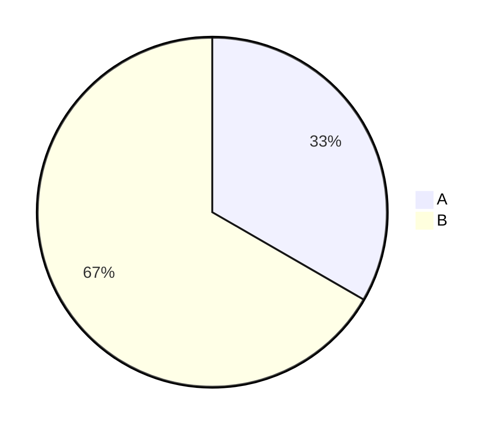
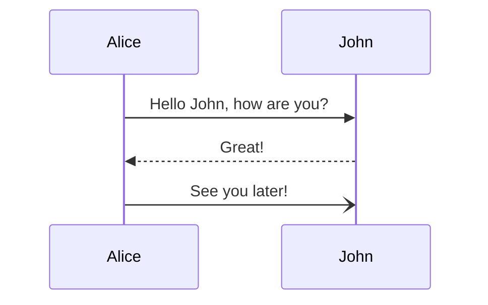
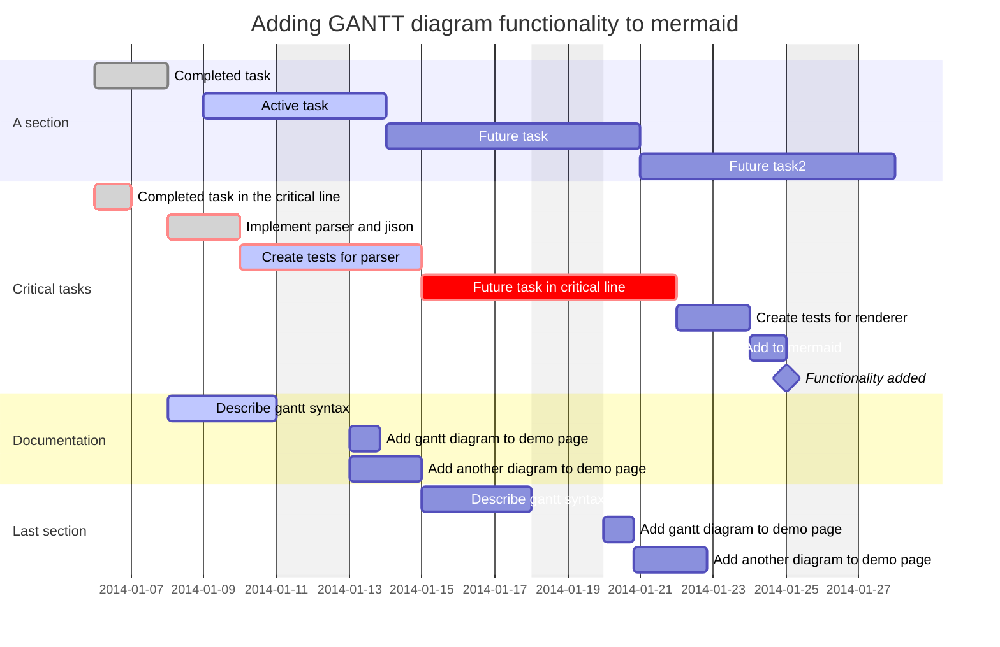

| 项目 / Name             | 描述 / Description          |
| --------------------- | ------------------------- |
| 药水棉签 / Potion Swab    | 最多同时包含两个药水效果，攻击传递，最多堆叠16个 |
| 方块涂色 / Block Painting |                           |
| 末影猫 / Ender Cat       |                           |
| 骰子 / Dice             |                           |
| 组合材质方块                |                           |
| 组合数值工具                |                           |
| AI驱动的创意系统             |                           |
| 化学系统                  |                           |
| 量子力学                  |                           |
| 增加触及距离的状态效果           |                           |
| ...                   |                           |
|                       |                           |

### 方块愚者 · 重生 / The Blockheads: Reborn（#`BHR_`）