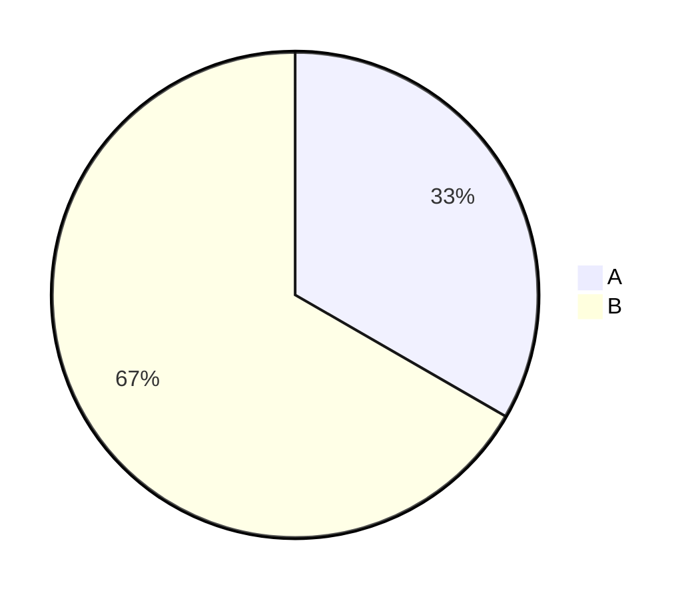
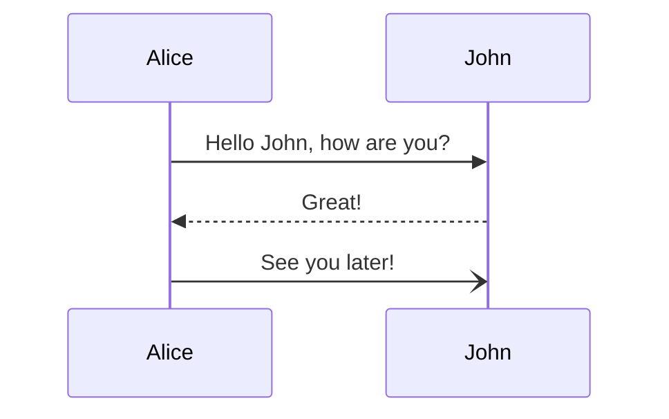
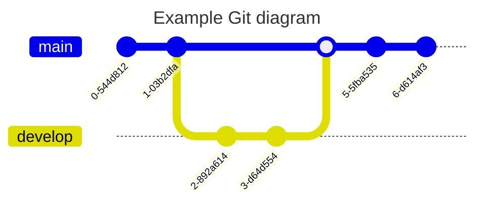

| 项目 / Name                 | 基本实现 / Started |
| ------------------------- | -------------- |
| 多任务队列系统 / Queue System    |                |
| 兑换式合成系统 / MATTIS          |                |
| 合成任务列表 / Craft Tasks List |                |
| 熔炼合成燃料热值 / Fuel System    |                |
| 精力值 / Energy Bar          |                |
| 环境值 / Environment Bar     |                |
| 快乐值 / Happy Bar           |                |
| 濒死生命值                     |                |
| 冥想奖励 / Mediate Bonus      |                |
| ...                       |                |

| 项目 / Name                      | 基本实现 / Started | 战利品表 / Loot | 合成配方 / Recipe | 可获得性 / Obtainability |
| ------------------------------ | -------------- | ----------- | ------------- | -------------------- |
| 柠檬茶 / Lemon Tea                |                |             |               |                      |
| 液体泥沼 / Liquid Mud              |                |             |               |                      |
| 沸水 / Boiled Water              |                |             |               |                      |
| 反相水 / Inverted Water (SCP-009) |                |             |               |                      |
| 固化水 / Static Water             |                |             |               |                      |
| 固化岩浆 / Static Lava             |                |             |               |                      |
| 弹力胶块 / Bouncy Block            |                |             |               |                      |
| 气凝胶 / Aerogel                  |                |             |               |                      |
|                                |                |             |               |                      |

