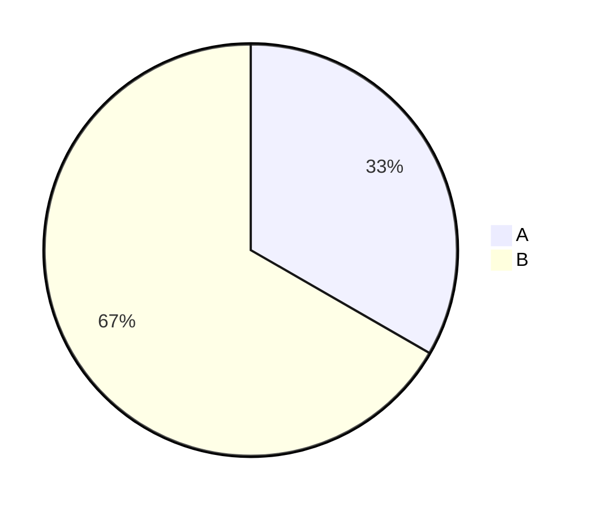
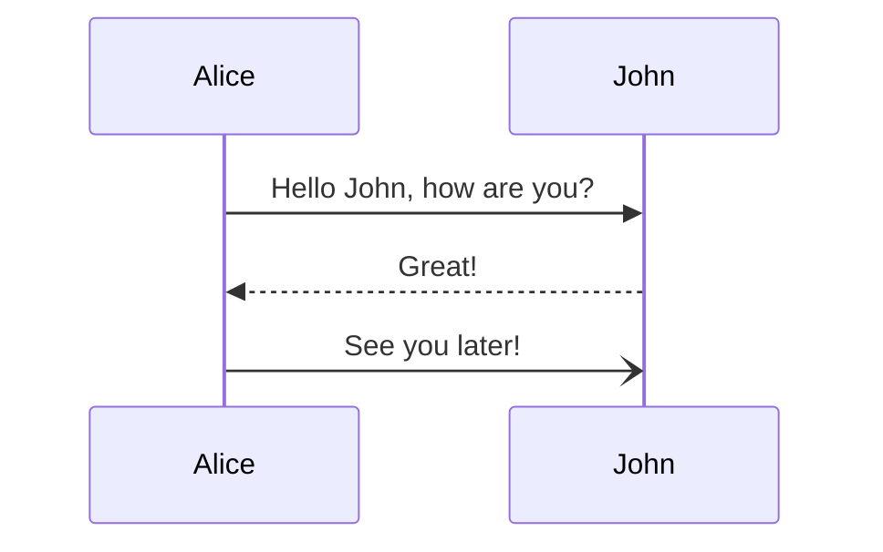
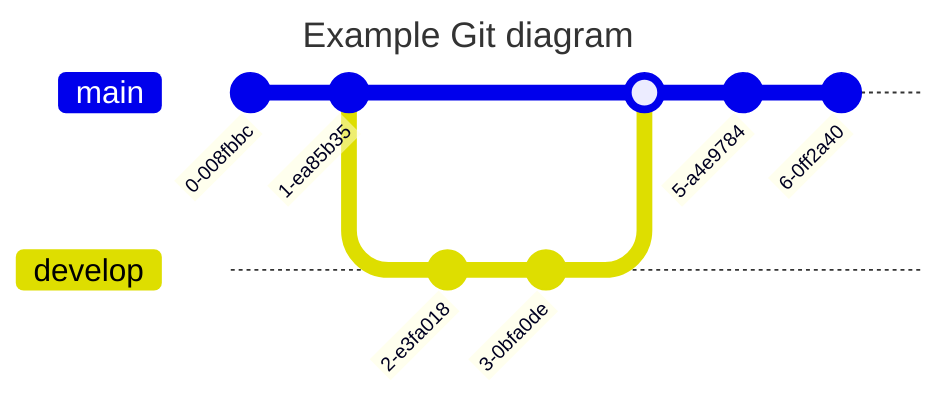

### 方块愚者 · 重生 / The Blockheads: Reborn（#`BHR_`）

$$设级数\frac{x^4}{2\cdot4}+\frac{x^6}{2\cdot4\cdot6}+\frac{x^8}{2\cdot4\cdot6\cdot8}+\cdots的和函数为S(x), 求S(x)的表达式$$

So much work and so many people to even report a violation, that me, a chump YouTuber was the one spearheading this, that it was easily derailed by a bigger YouTuber convincing gamer that having their game destroyed is a good thing.

kuangxilai@gmail.com
GMTk63@3
:HkWBxAFJJf65Hi
:hgfy653@
GMTk32@1

45:00、43:10、41:20、39:30、37:40、35:50、34:00、32:10、30:20、28:30、26:40、24:50、23:00、21:10

1.p6
2.p
3.p13
4.p(六个方格的前一页)
5.p23
6.p29
7.p
1.p
2.p
3.p
1.p44

