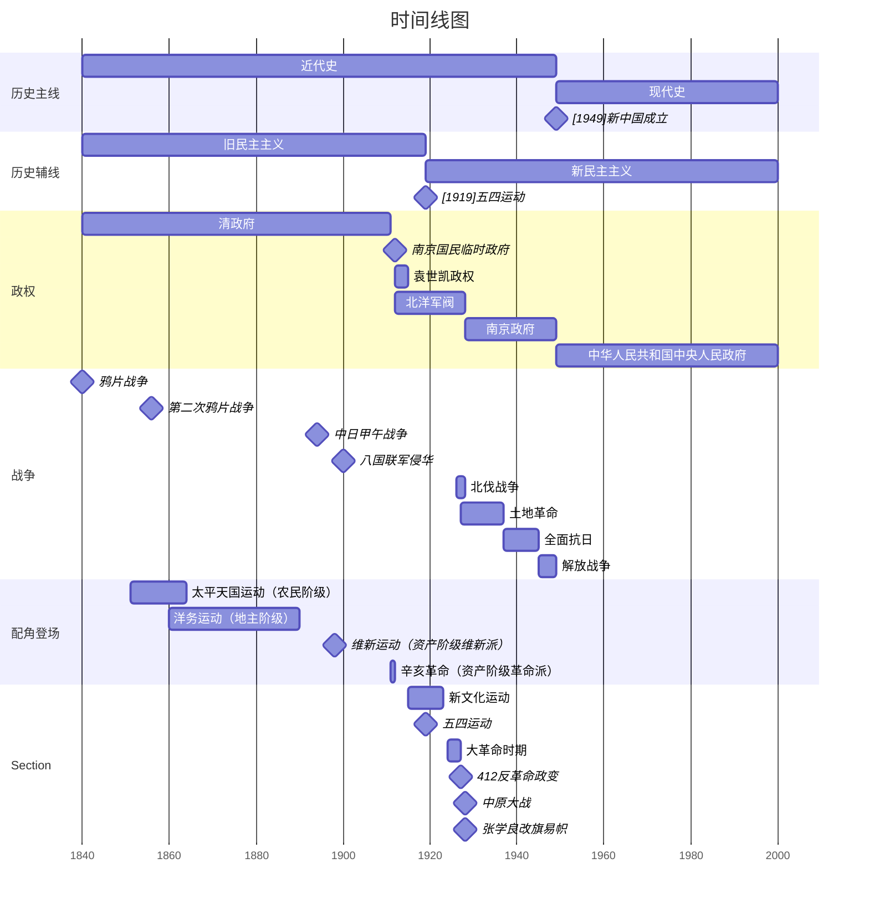

哲学的基本问题：思维和存在的关系问题
马原四大范畴：
	唯物论（辩证唯物主义）：自然领域
	辩证法（唯物辩证法）；
	认识论：认识领域，实践与认识的关系
	唯物史观（历史唯物主义）：人类社会领域，社会存在与社会意识
		三对关系、社会形态
		社会历史观的基本问题
		社会的基本矛盾（人类社会发展的基本规律）
		生产力与生产的关系：经济基础与上层建筑
		————分割线————
		改革在社会发展中的作用
		科学技术
		文化
		人民群众与杰出人物
政治经济学：
	自由竞争阶段的资本主义
	简单商品经济
	发达商品经济（资本主义的商品经济）
	垄断阶段的资本主义
		私人垄断 -> 国家垄断
科学社会主义：
	社会主义
	共产主义

中国近现代史纲要：
中国近代史（1840-1949）：
	旧民主主义（1840-1919）：
		农民阶级（太平天国）
		地主阶级（洋务运动）
		资产阶级维新派（维新运动）
		资产阶级革命派（辛亥革命）
		注意：孙中山先生只褒不贬
	新民主主义（1819-1949）：
		大革命时期（1924-1927）
		土地革命战争时期（1927-1937）
		全面抗战时期（1937-1945）
		解放战争时期（1945-1949）
中国现代史（1949-xxxx）：

毛中特+新思想
毛泽东思想（第一次飞跃）
	革命的首要问题：分清敌友
中国特色社会主义理论体系（新的飞跃）
	邓小平理论
	三个代表重要思想（非重点）
	科学发展观（非重点）
	习近平新时代中国特色社会主义思想
习近平新时代中国特色社会主义思想
	十个明确
	十四个坚持
	十三个方面成就
	全面建设社会主义现代化国家
	全面从严治党
	全面深化改革开放
	全面依法治国
	社会建设
	经济建设
	政治建设
	文化建设
	生态文明建设
	国家安全
	国防和军队（非重点）
	港澳台（历史遗留问题）
	外交

思想道德与法治
思想：
	人生观
	理想信念
	价值观
道德：
	三纵四横
		优秀传统文化
		近代革命
		先进文化
		社会公德
		职业道德
		家庭美德
		个人品德
法治：
	社会主义法律
	全面依法治国
	宪法
	权利和义务

时事政治：

X届Y中全会

| X   | 年份   |
| --- | ---- |
| 19  | 2017 |
| 20  | 2022 |
| 21  | 2027 |

| Y   | 内容摘要    | 重要标记 |
| --- | ------- | ---- |
| 1   | 党干部选举   |      |
| 2   | 国家干部选举  |      |
| 3   | 经济相关    | ☆    |
| 4   |         | ☆    |
| 5   |         | ☆    |
| 6   |         | ☆    |
| 7   | 下一次党会筹备 |      |


# 马克思主义基本原理
## 马克思主义哲学
### 绪论
#### 考点1.0.1
马克思的两大发现：
	唯物史观
	剩余价值学说
马克思注意的直接理论来源与构成：

| 来源        | 构成        |
| --------- | --------- |
| 德国古典哲学    | 马克思哲学     |
| 英国古典政治经济学 | 马克思政治经济学  |
| 英法空想社会主义  | 马克思科学社会主义 |
马克思主义产生的自然科学前提：
	细胞学说
	能量守恒定律
	生物进化论


#### 考点1.0.2 
马克思主义创立的条件：
	社会根源：资本主义经济的发展（经济决定政治和思想）
	阶级基础
	思想渊源


#### 考点1.0.3
马克思&恩格斯著作：

| 作者    | 著作      | 帽子                    | 标志          |
| ----- | ------- | --------------------- | ----------- |
| Mk&Eg | 德意志意识形态 | 首次系统阐述历史唯物主义基本观点      | 马克思主义哲学的诞生  |
| Mk&Eg | 共产党宣言   | 无产阶级政党（共产主义者同盟）的第一个党纲 | 马克思主义的诞生    |
| Mk    | 资本论     | 首次系统阐述剩余价值学说          | 马克思政治经济学的诞生 |
| Mk&Eg | 德法年鉴    |                       | 从唯心到唯物      |
| Eg    | 反杜林论    | 全面阐述马克思主义理论体系         |             |

#### 考点1.0.4
马克思主张多国胜利论
列宁提出一国胜利论（一国或数国首先发生并取得胜利）
	根据：经济政治发展不平衡规律

#### 考点1.0.5
马克思主义的鲜明特征：

| 特征  | 帽子            |
| --- | ------------- |
| 科学性 | 根基、科学的时间观和方法论 |
| 人民性 | 本质属性          |
| 实践性 | 首要的的和基本的观点    |
| 发展性 | 具有与时俱进的理论品质   |
用一句话概括：科学性与革命性（人/实/发）的统一

### 唯物论
#### 考点1.1.1 哲学的基本问题
其他流派：

|            |      |               |
| ---------- | ---- | ------------- |
| 近代形而上学唯物主义 | 唯物主义 | 孤立、静止、片面、半截子式 |
| 古代朴素唯物主义   | 唯物主义 |               |
| 主观唯心主义     | 唯心主义 |               |
| 客观唯心主义     | 唯心主义 | 绝对精神、上帝       |

#### 考点1.1.2 物质及其物质范畴
人是一切社会关系的总和
物质的定义：补充
物质的唯一特性：客观实在性
物质范畴（物质意义）：
	坚持唯物主义一元论
	坚持能动反映论和可知论
	体现了唯物论和辩证法的统一
	体现了唯物主义历史观和历史观的统一

#### 考点1.1.3 物质与运动
物质的根本属性是运动
运动是物质的运动
物质是运动的运动
脱离物质：唯心主义
脱离运动：形而上学
例子：人不能连续踏进（静止）两次同一条河流（运动）

#### 考点1.1.4 运动与静止
静止是物质运动的稳定状态和特殊状态
运动与静止的对立统一关系
```
答题模板
对立性：二者相互区别
同一性：二者相互联系，并在一定条件下相互转化
```
对立性：
补充
同一性：
补充

#### 考点1.1.5 物质运动的时空观
时空的特点是唯一性
时空是物质运动的载体
时空是物质运动的存在形式
有限的：具体的物质形态（人）
无限的：整个物质世界（人类社会）

#### 考点1.1.6 物质与意识的辩证关系
物质决定意识
	意识的起源：意识也是物质的，是自然界长期发展的产物
		自发：动物本能反应
		自觉：人类意识
	意识的本质：客观世界的主观意象
		内容是客观的：一瓶饮料
		形式是主观的：没喝知道什么味
意识对物质具有反作用
	意识活动具有目的和计划
	意识活动具有创造性
	意识具有指导实践改造客观世界的作用
	意识具有调控人的行为和生理活动的作用

#### 考点1.1.7 主观能动性与客观规律性
规律：
	固有的、内在的、本质的、必然的，联系
	客观的
	不可创造或改变，但可以创造条件（发挥主观能动性）去认识
人类社会是由【必然】走向【自由】的
关系：
	尊重客观规律是正确发挥主观能动性的前提。
	只有充分发挥主观能动性，才能正确认识和利用客观规律
A与B的统一只能通过实践

#### 考点1.1.8 人工智能
人工智能不能代替意识的原因：
	不具备情感、信念、意志等
	不具备人类的社会属性
	不完全具备自然语言真实意义
	某些意识无法化约

#### 考点1.1.9 物质世界的两重化
人的实践活动是自然界与人类社会、客观世界与主观世界
相分化的关键，也是他们相统一的关键。

#### 考点1.1.10 物质世界的统一性
自然界统一于物质
人类社会也统一于物质
人的意识统一于物质
世界的物质统一性原理是辩证唯物主义最基本、最核心的
观点，是马克思主义的基石。

### 辩证法
两个总观点：联系、发展
三大规律：矛盾
五对范畴
#### 考点1.1.11 联系的含义及其特征
**用联系的关系看问题**
先有联系才有发展和矛盾
	联系具有客观性（用联系的关系看问题）
	联系具有普遍性（万事万物都是联系着的，但是两个事物之间需要创造条件和中介来建立联系）
	联系具有多样性（眷顾各个层面，联系的方式有多样）
	联系具有条件性（化不利条件为有利条件）

#### 考点1.1.12 发展的实质及其原因
**用发展的眼光看问题**
【发展】是前进的、上升的【运动】
发展的实质是新事物的产生和旧事物的灭亡
	新事物：符合历史发展，适应环境的变化
	旧事物：不符合。。。，不适应。。。
	新事物=旧事物-糟粕+精华+创新
事物的发展也是一个过程
一切事物只有经过一定的过程才能实现自身的发展。

#### 考点1.1.13 对立统一规律
矛盾是反映事物内部和事物之间对立统一关系的哲学范畴
	同一性（统一）：相互依存、相互贯通、可以相互转化
	斗争性（对立）：相互排斥、相互分离
斗争性寓于同一性之中，同一性通过斗争性来体现。
	因为在同一层，所以才有斗争
学会求同存异，从对立中把握统一，从统一中把握对立。
正确把握和谐对社会发展的作用。和谐是矛盾的一种特殊表现形式是相对的、有条件的。

矛盾的普遍性和特殊性辩证关系
普遍性：矛盾无处不在，矛盾无时不有
特殊性：矛盾的不平衡性，有主次
辩证关系：矛盾的普遍性即矛盾的共性，矛盾的特殊性即矛盾的个性，任何现实存在的事物的矛盾都是共性和个性的有机统一，共性寓于个性之中，没有离开个性的共性，也没有离开共性的个性。
矛盾的共性和个性相统一的关系，既是客观事物固有的辩证法，也是科学的认识方法。人的认识的一般规律就是由认识个别上升到认识一般，再有一般到个别的辨认发展过程。

两点论：矛盾的对立和统一，主要和次要都要看到
重点论：解决主要的矛盾、解决矛盾的主要关系
看问题既要全面地看，又要看主流、大势、发展趋势。

社会主义的主要矛盾：
人民日益增长的美好生活需要与不平衡不充分发展的矛盾

#### 考点1.1.14 量变质变规律
度：度是保持事物质的稳定性的数量界限
	量变：事物数量的增减和组成要素排列次序的变动，是保持事物的质的相对稳定性的不显著变化，体现了事物发展渐进过程的连续性。
	质变：事物性质的根本变化，是事物由一种质态向另一种质态的飞跃，体现了事物发展渐进过程和连续性的中断。
辩证关系
	量变是质变的必要准备
	质变是量变的必然结果
	量变和质变是相互渗透的
方法论：
	要果断的，不失时机地抓住机遇

#### 考点1.1.15 否定之否定规律
基本内容：
	第一，否定是事物的自我否定，是事物内部矛盾运动的结果。
	第二，否定是事物发展的环节，是旧事物向新事物的转变，是从旧质到新质的飞跃。只有经过否定，旧事物才能向新事物转变。
	第三，否定是新旧事物联系的环节，新事物孕育产生于旧事物，新旧事物是通过否定环节联系起来的。
	第四，辩证否定的实质是“扬弃”，即新事物对旧事物既批判又继承，既克服其消极因素又保留其积极因素。
事物的辩证发展就是经过两次否定、三个阶段，形成一个周期
事物的发展呈现出波浪式前进或螺旋式上升的总趋势。
否定之否定规律揭示了事物发展的前进性（方向）与曲折性（方式）的统一。

#### 考点1.1.16 联系和发展的基本环节
对立统一
对立：X与X相互区别
统一：X与X相互依存，在一定条件下相互转化

内容决定形式，形式反映内容
同一内容可以通过多种形式来体现，同一形式也可以表现不同的内容。

本质决定现象，现象表现本质。
任何现象都从一定的方面表现着本质，即是假象也是本质的表现。
现象是多变易逝的，本质是相对稳定的

假象引起错觉，错觉是主观的，假象是客观的

人们正是通过对事物现象的去粗取精、去伪从真，由此及彼、由表及里的认识过程，才不断深化对事物本质的认识。

原因与结果
含义：引起某种现象的现象就是原因，被某种现象所引起的现象就是结果

必然与偶然
必然是确定不移的趋势
必然与偶然相互依存。
没有脱离偶然的必然，也没有脱离必然的偶然。
必然存在于偶然之中，通过大量的偶然表现出来

现实与可能
一旦主客观条件成熟，可能就会转化为现实
条件是否充分：现实可能性｜抽象可能性（大海捞针）
条件是否有无：可能性｜不可能（猴子捞月）
方法论：立足现实，发挥主观能动性，争取实现好的可能
#### 考点1.1.17 思维能力
辩证思维能力
- 辩证思维能力是唯物辩证法在思维中的应用，是指从事物相互关系、相互作用关系出发，分析矛盾、抓住关键、找准重点、洞察事物发展规律的能力
系统思维能力（=联系）
- 系统思维能力是从事物相互联系的各个方面极其结构和功能进行系统思维能力，就是全面系统地分析和处理问题的能力
创新思维能力（=发展）
- 创新思维能力是对常规思维的突破，就是破除迷信、超越过时的陈规，善于因地制宜、知难而进、开拓创新的能力
历史思维能力

底线思维能力

注意：考试辩证法的原理必须写两个，少了就猜，多了就删，千万不能写多了
### 认识论

#### 考点1.2.1 实践的基本特征
实践是人类能动得改造世界的社会性的物质活动
	实践具有客观实在性
	实践具有自觉能动性
	实践具有社会历史性

#### 考点1.2.2 实践的基本结构
人的实践活动是以改造客观世界为目的的客观过程，是实践的主体与客体之间的相互作用，这种相互作用必须借助一定的手段和工具（实践的中介）
实践主体：具有一定的主体能力从现实社会实践活动的人，是实践活动中自主性和能动性的因素

关系：实践的主体和客体相互作用的关系，包括实践关系、认识关系和价值关系，其中实践关系是最根本的关系。
实践的基本结构也是历史地变化发展的，这种变化主要表现为主体客体化与客体主体化的双向运动。  
主体客体化：是人通过实践使自己的本质力量作用与客体形成了世界上本来不存在的对象物。  
客体主体化：是客体从客观对象的存在形式转化为主体生命结构的因素或主体本质力量的因素。客体失去客体性的形式，变为主体的一部分。

#### 考点1.2.3 实践的基本形式
实践可分为三种基本类型： 
- 物质生产实践：是最基本的实践活动。
- 社会政治实践：是形成各种社会关系的实践活动。 
- 科学文化实践：是创造精神文化产品的实践活动。

#### 考点1.2.4 实践是认识的决定作用
实践具有以下作用
	实践是认识的来源
	实践是认识的发展动力
		【实践的需要】
			推动【认识】的【产生和发展】
				（古代农民的天文学好，地主的数学好，但没有物理和化学好的人）
			推动人类的科学发现和技术发明
			推动人来的思想进步和理论创新
	实践是认识的目的
	实践是检验认识真理性的唯一标准

#### 考点1.2.5 认识的本质
辨析旧唯物主义和辩证唯物主义
观点：直观的观点｜实践的观点
辩证：死板的｜能动的

旧唯物主义：直观的反映（照镜子式反应）
辩证唯物主义：反映性特征与创造性特征的统一

#### 考点1.2.6 认识的过程
两次飞跃：
- 从实践到认识
	- 在实践基础上，从感性认识到理性认识
	- 感性认识包括：感觉、知觉、表象（递进关系）
		- 感性认识有待遇发展和深化为理性认识
		- 感性认识以待遇感性认识
		- 感性认识和理性认识相互渗透、相互包含
	- 理性认识包括：概念、判断、推理（递进关系）
- 从认识到实践

#### 考点1.2.7 实践与认识的辩证运动规律
认识是一个反复循环和无限发展的过程，这个过程既不是封闭式 循环，也不是直线式发展，而是一个波浪式前进好螺旋式上升的过程。

#### 考点1.2.8 真理的含义及其特征（知识性认识）
真理是标志主观与客观相符合的哲学范畴，是对客观事物及其规律的正确反映
	客观性：真理的内容是对客观事物及其规律的正确反映，真理包含着不依赖于任何人的意识的客观内容，具有唯一性
	绝对性：主客观相符合、人类社会无限接近真理
	相对性：特定部分特定时段的有限度的正确认识、深度有限，有待深化
		真理的绝对性寓于相对性之中，真理的相对性包含并包含真理的绝对性
		无数相对真理的综合就是绝对真理$$\sum^{\infty}相对真理=绝对真理$$
	

#### 考点1.2.9 真理与谬误
对立统一的关系

#### 考点1.2.10 实践是检验真理的唯一标准
如题，只有实践才能将主观与客观架构起来

#### 考点1.2.11 价值的含义及其特征（评价性认识）
价值是指在实践基础上形成的主客体之间的意义关系。
	主题的需要
	客体的特性
价值的特征
	价值的客观性：不依赖主体的意识而存在
	价值的主体性：同一客体相对于不同的主体具有不同价值
	价值的多维性：同一客体相对于主体的不同需要会产生不同的价值 
	价值的社会历史性

#### 考点1.2.12 价值的评价
价值评价是主体对客体的价值以及价值大小所做的评判或判断
特点：
	评价以主客体的价值关系为认识对象
	评价结果与评价主体直接相关
	评价有科学与非科学之分
	评价结果的正确与否依赖于客体状况和主体需要的认识

#### 考点1.2.13 真理与价值的辩证统一
任何成功的实践都是真理尺度与价值尺度的统一
是合规律性（真理）和合目的性（价值）的统一
实践的过程要遵循真理尺度与价值尺度的统一

自然规律与人类社会发展规律也体现了合规律性（真理）和合目的性（价值）的统一

#### 考点1.2.14 必然与自由
人类社会是从必然走向自由的

#### 考点1.2.15 

### 唯物史观
#### 考点1.3.1 社会存在与社会意识的辩证关系
社会存在
	社会存在也称社会物质生活条件，是社会生活的物质方面，主要包括自然地理环境。人口因素和物质生产方式
		自然地理环境：人类社会生存和发展的永恒的必要的条件，是人们生活和生产的自然基础。
		人口因素：社会存在和发展的必要条件，它对社会发展起者重要作用。
		【重点】自然地理环境和人口因素：对社会发展起着加速或延缓的作用，但都不能脱离社会生产而发生作用，都不能决定社会的性质和社会形态的更替
	物质生产方式基社会存在和发展的基础及决定力量。
		物质生产活动及生产方式是人类社会瓶以存在和发展的基础
		物质生产活动及生产方式决定者社会的结构、性质和面貌
		物质生产活动及生产方式的变化
	发展决定整个社会历史的变化，发展决定社会形志从低级向高级的更替和发展
	生产=生产力+生产关系
社会意识
	社会意识是社会生活的精神方面，是社会存在的反映
	根据不同的主体，社会意识分为个体意识和群体意识
	根据不同的层次，社会意识分为社会心理和社会意识形式
		在社会意识形式之中，有存在意识形态和非意识形态之分（有无阶级性）
辩证关系
	社会存在决定社会意识
	社会意识是社会存在的反映，具有相对独立性
		社会意识与社会存在发展的不完全同步性和不平衡性
		社会意识内部各种形式之间的相互影响以及各自具有的历史继承性
		【重要】社会意识对社会存在能动的反作用
社会存在和社会意识的辩证关系的原理和意义
#### 考点1.3.2 社会基本矛盾及其运动规律（人类社会发展的基本规律）
生产资料：
	劳动资料：也称劳动手段。其中最重要的是生产工具。生产工真是生产生产力发展水平的客观尺度，是区分社会经济时代的客观依据
	劳动对象：一切自然物质都有可能是劳动对象，其中引入生产过程的部分则是现实的劳动对象芳动者
劳动者：是具有一定生产经验、劳动技能和知识，能够运用一定劳动资料作用于劳动对象从事生产实践活动的人。劳动者是生产力中最活跃的因素
生产关系：人们在物质生产中形成的不以人的意志为转移的经济关系
	生产关系包括生产资料所有制关系， 生产中人与人的关系和产品分配关系。生产资料所有制关系是最基本决定性的，它是人们进行物质资料生产的前提，构成全部生产关系的基础，是区分不同生产方式，判定社会经济结构性质的客观依据。
生产力决定生产关系，生产关系反作用于生产力
生产关系一定要适合生产力状况的规律

| 会议      | 主要内容        |
| ------- | ----------- |
| 十一届三中全会 | 改革开放        |
| 十八届三中全会 | 全面深化改革开放    |
| 二十届三中全会 | 进一步全面深化改革开放 |
经济基础与上层建筑辩证关系
	经济基础：有社会一定发展阶段的生产力所决定的生产关系的总和
	上层建筑：建立在一定经济基础之上的意识形态及其制度、组织、设施
	关系：
		经济基础决定上层建筑
		上层建筑对经济基础具有反作用
		省层建筑一定要适合经济基础状况的规律
	生产力决定一切
	发展是解决一切问题的关键

#### 考点1.3.3 社会进步与人的发展
人的发展程度构成了社会进步的重要标志

#### 考点1.3.4 社会形态及其特征
社会形态=经济基础+上层建筑
特征：
	社会形态更替的统一性和多样性
	社会形态更替的必然性与人们的历史选择性
	社会形态更替的前进性与曲折性

#### 考点1.3.5 社会历史发展的动力
社会基本矛盾在历史发展中的作用
	社会基本矛盾是历史发展的根本动力
改革与革命
	革命：彻底性，革的是制度
	改革：不彻底，改的是体制
	社会主义改革是彻底性的（社会主义改革是中国的第二次革命）
	党的建设是自我革命
科学技术在社会发展中的作用
	科技对生产方式、生活方式、思维方式产生了影响
	自然与人的关系认识不深刻，科学技术导致自然污染
	特定的社会制度，科学技术常常被用于剥削压迫
唯物史观考察历史创造者问题的方法论原则
	【重点】唯物史观立足于现实的人及其本质来把握历史的创造者。马克思指出，人的本质不是单个人所固有的抽象物，在其现实性上，它是一切社会关系的总和。
	【重点】唯物史观立足于整体的社会历史过程来探究谁是历史的创造者。历史是无数个追求着自己目的的人的活动的合力。就每一个人而言，他在一定意义上创造了自己个体的历史，但这并不能与创造社会历史划等号。
	唯物史观从社会历史发展的必然性入手，来考察和说明谁是历史创造者。社会历史的变化发展是社会领域中各种力量交互作用的结果。
	唯物史观从人与历史关系的不同层次上考察谁是历史的创造者

#### 考点1.3.6 人民群众
人民群众是社会历史的主体，是历史的创造者。这是马克思主义最基本的观点之一。人民群众是一个历史范畴。
	质：人民群众是指一切对社会里是发展起推动作用的人
	量：人民群众是指社会人口中的绝大多数
作用：
	社会物质财富的创造者
	社会精神财富的创造者
	社会变革的决定力量

#### 考点1.3.7 杰出人物
作出重要贡献或起重要作用的的人
不能决定和改变历史发展的总进程和总方向

## 政治经济学
### 简单商品经济
#### 考点1.4.1 商品经济产生的历史条件
商品经济是以==交换==为目的而进行生产的经济形式，它是一定社会历史条件的产物
商品经济得以产生的社会历史条件：
	存在社会分工
	生产资料和劳动产品属于不同的所有者

#### 考点1.4.2 商品的因素
商品是用来==交换==、能满足人的某种需要的==劳动产品==，具有==使用价值==和==价值==两个因素或两种属性，是使用价值和价值的矛盾统一体。
	使用价值是指商品能满足人的某种需要的有用性，反映的是人与自然之间的物质关系，是商品的自然属性，==使用价值构成社会财富的物质内容==
	价值是凝结在商品中的==无差别的==一般人类==劳动==，即人的脑力和体力的耗费。==价值是商品所特有的社会属性==
	交换价值==「不」属于==商品价值，而是一种关系或比例，由价值来决定
辩证关系：
	商品的使用价值和价值之间是对立统一的关系。
	对立：
		商品的使用价值和价值是相互排厅的，二者不可兼得
		要获得商品的价值，就必须放弃商品的使用价值；要得到商品的使用价值，就不能得到商品的价值
		商品生产者生产商品并不是为了取得使用价值，而是为了取得价值，只是为了取得价值，才关心使用价值
	统一：
		作为商品，必须同时具有使用价值和价值两个因素
		使用价值是价值的物质承担者，价值寓于使用价值之中

#### 考点1.4.3 劳动二重性
商品是劳动产品，生产商品的劳动可区分为具体劳动和抽象劳动。
	具体劳动：指==生产一定使用价值==的具体形式的劳动
		形成==使用价值==
	抽象劳动：指撇开一切具体形式的、==无差别的==一般人类==劳动==，即人的脑力和体力的耗费
		形成==价值==
劳动二重性决定商品的因素
抽象劳动是价值的「唯一」源泉，具体劳动是使用价值（社会财富）的源泉「之一」。
	例：并非所有财富需要通过具体劳动所得，如黄金（由大自然形成）
#### 考点1.4.4 商品价值量的规定
商品的价值包括质的规定与量的规定两个方面。
	价值的质的规定回答的是价值的实体是什么
	【重点】价值的量的规定则回答价值的大小由什么决定和怎样决定
		价值量是由劳动者生产商品所耗费的劳动量决定的，而劳动量则按照劳动时间来计量。
		决定商品价值量的不是生产商品的个别劳动时间，而只能社会必要劳动时间。
		$$价值\propto 社会必要劳动时间~~~~~价值\propto 劳动生产率^{-1}$$

|           | 单位商品价值量    | ～数量        | ～价值总量      | ～使用价值 |
| --------- | ---------- | ---------- | ---------- | ----- |
| 社会劳动生产率提高 | $\searrow$ | $\nearrow$ | $=$        | $=$   |
| 个别劳动生产率提高 | $=$        | $\nearrow$ | $\nearrow$ | $=$   |

#### 考点1.4.5 简单劳动与复杂劳动
简单劳动是指不需要经过专门训练和培养的一般劳动者能都能从事的劳动
复杂劳动是指需要经过专门训练和培养，具有一定文化知识和技术专长的劳动者所从事的劳动。
在以私有制为基础的商品经济条件下，复杂劳动转化为简单劳动，不是商品生产者自觉计算出来的，而是在商品交换过程中「自发」实现的。
	注意：此处的自发是正确的说法，政治经济学的自发不一定是错的

#### 考点1.4.6 货币的产生
商品的交换是以货币为媒介的。
货币是在长期交换过程中形成的固定充当一般等价物的==商品==。（足值的金银）
	金银天然非货币，货币天然是金银
	纸币本身没有价值
		布雷顿森林体系：美元与黄金挂钩，其他货币与美元挂钩
		人民币与国家信誉挂钩
货币具有五种基本的职能：
	==价值尺度==（观念货币）
	==流通手段==（现实货币，现货交易）
	贮藏手段
	==支付手段==（延期交易：结算业务$_{(支付工资)}$、偿还债务）
	世界货币
	注意：
		网购也属于现货交易，虽然有时间差和空间差

#### 考点1.4.7 价值规律的作用及表现形式
价值的规律遵循的是==等价交换==
价值规律的表现形式是商品的价格围绕商品的价值「自发」波动。
	价值决定价格，价格反映价值
价值规律是在市场配置资源的过程中体现它的客观要求和作用的。价值规律的作用表现在：
	自发地调节生产资料和劳动力在社会各生产部门之间的分配比例
	自发地刺激社会生产力的发展。在商品经济条件下，商品是按照由社会必要劳动时间所决定的社会价值进行交换的
	自发地调节社会收入的分配
消极后果：
	导致社会资源浪费
	阻碍技术进步
	导致收入两极分化

#### 考点1.4.8 以私有制为基础的商品经济的基本矛盾（简单商品经济矛盾）
货币的出现，知识解决了商品交换的困难，并为解决商品内在的矛盾
==私人劳动和社会劳动的矛盾构成私有制商品经济的基本矛盾==
	私人劳动和社会劳动的矛盾决定着商品经济的本质及发展过程。
	私人劳动和社会劳动的矛盾是商品经济其他一切矛盾的基础。
	私人劳动和社会劳动的矛盾决定着商品生产者的命运。
私人劳动和社会劳动的矛盾决定了劳动二重性

#### 考点1.4.9 资本主义的基本矛盾
在私有制商品经济条件下，私人劳动和社会劳动之间的矛盾是私有制商品经济的基本矛盾。
在资本主义制度下，这种矛盾进一步发展成资本主义的基本矛盾，
即==生产资料资本主义私人占有和生产社会化之间的矛盾==。

#### 考点1.4.10 马克思的劳动价值论
马克思劳动价值论的理论和实践意义：
	马克思劳动价值论扬弃了英国古典政治经济学的观点，为剩余价值论的创立奠定了基础。
	马克思劳动价值论揭示了私有制条件下商品经济的基本矛盾，为从物与物的关系背后揭示人与人的关系提供了理论依据。
		揭露了拜物教（商品拜物教、货币拜物教）
	马克思劳动价值论揭示了商品经济的一般规律，对理解社会主义市场经济具有指导意义
深化马克思劳动价值论认识
	深化对创造价值的劳动的认识，对生产性劳动做出新的界定
	深化对科技人员、经营管理人员在社会生产和价值创造中所起作用的认识
	深化对价值创造与价值分配关系的认识

### 发达商品经济
#### 考点1.4.11 资本原始积累
所谓资本原始积累，就是以暴力手段使生产者与生产资料相分离，货币资本迅速集中于少数人手中的历史过程。

资本原始积累的途径主要有两个：

	用暴力手段剥夺农民的土地

	用暴力手段掠夺货币财富
西式现代化：资本原始积累
中式现代化：

#### 考点1.4.12 劳动力商品的特点
劳动力是指人的劳动能力，是人的体力和脑力的总和。劳动力的使用及劳动。
==劳动力成为商品要具备两个基本条件==：
	劳动者是自由人
	劳动者没有别的商品可以卖。
劳动力成为商品，标志着简单商品生产发展到资本主义商品生产的新阶段。在这一阶段，资本家与工人的关系
形式上是自由平等的买卖关系，而实质上是==资本主义的雇佣劳动关系==。

像任何商品一样，劳动力商品也具有价值和使用价值。
劳动力的价值，是由生产、发展、维持和延续劳动力所必需的生活必需品的价值决定的。它包括三个部分：
	维持劳动者本人生存所必需的生活资料的价值
	维持劳动者家属的生存所必需的生活资料的价值
	劳动者接受教育和训练所支出的费用
劳动力商品在使用价值上有一个很大的特点，就是它的使用价值是价值的源泉
一旦货币购买的劳动力带来剩余价值，货币也就变成了资本。

#### 考点1.4.13 生产剩余价值是资本主义生产方式的绝对规律（剩余价值的生产）
资本主义的生产过程具有两重性，一方面是生产物质资料的劳动过程，另一方面是生产剩余价值的过程，即价值增殖过程。==资本主义生产过程是劳动过程和价值增殖过程的统一==。
资本主义劳动过程的两个特点：
	工人在资本家的监督下劳动，他们的劳动隶属于资本家
	劳动的成果或者产品全部归资本家所有
价值增殖过程是剩余价值的生产过程，这是资本主义生产过程的主要方面。
体现了资本家与雇佣工人之间的剥削与被剥削的关系

#### 考点1.4.14 剩余价值的实质
资本家购买的劳动力在生产过程中创造了超过补偿劳动力的价值，从而形成了剩余价值，这是价值形成过程转变为价值增值过程的关键。
#### 考点1.4.15 不变资本与可变资本
资本是可以带来剩余价值的价值，剩余价值是由雇佣工人的剩余劳动创造的。在资本主义社会里，资本总是通过各种物品表现出来，但==资本的本质不是物，而是一定的历史社会形态下的生产关系==。
	不变资本转移价值量，是以生产资料形态存在的资本
	可变资本创造价值量，是用来购买劳动力的那部分资本
这种划分也为确定资本家对雇佣劳动者的剥削程度提供了科学依据
马克思主义揭露：资本=不变资本（Cst.）+可变资本（Var.）
资本家立场：资本=全部预付资本=全部颠覆资本=投入

#### 考点1.4.16 剩余价值率
$$m_{\%}(剩余价值率)=\frac{m_{RM}(剩余价值)}{V_{ar}(可变资本)}$$

#### 考点1.4.17 绝对剩余价值与相对剩余价值
绝对剩余价值：延长工作日长度、提高劳动强度
相对剩余价值：缩短必要劳动时间（提高技术，但工资不变）
超额剩余价值：提高劳动生产率使得商品个别价值低于社会价值

#### 考点1.4.18 资本积累
资本主义简单再生产：
	例：100买1个劳动力赚了200，然后吃喝玩乐花100，剩100明天再买1个劳动力
资本主义扩大再生产
	例：100买1个劳动力赚了200，这200留着明天买2个劳动力赚更多
本质：
	资本家不断利用无偿占有的工人创造的剩余价值来扩大自己的资本规模，
	进一步扩大和加强对工人的剥削和统治。
源泉：
	资本积累的源泉是剩余价值。
后果：
	资本积累不但是社会财富占有两极分化的重要原因，
	而且是资本主义社会失业现象产生的根源。

#### 考点1.4.19 资本有机构成
在资本主义企业内部，资本家投入资本主义生产过程中的资本，
	从自然形式上看，总是由一定数量的生产资料和劳动力构成的。在生产资料和劳动力之间，存在着一定比例，
		这个比例取决于生产技术的发展水平。
			生产技术水平越高，每个劳动力所推动的生产资料的数量就越多；
			生产技术水平越低，每个劳动力所推动的生产资料的数量就越少。
		这种由生产的技术水平所决定的生产资料和劳动力之间的比例，叫作资本的技术构成。
	从价值形式上看，资本可分为不变资本和可变资本，这两部分资本价值之间的比例，叫作==资本的价值构成==。
在资本的技术构成和资本的价值构成之间存在密切的联系。
一般来说，资本的技术构成决定资本的价值构成，技术构成的变化往往会引起价值构成的相应变化，而价值构成的变化通常反映着技术构成的变化。
这种由资本的技术构成决定并反映技术构成变化的资本价值构成，叫作==资本的有机构成==
通常用Cst为不变资本，Var为可变资本。
$$资本有机构成=\frac{资本技术构成}{资本价值构成}$$
$$资本技术构成=\frac{生产资料}{劳动力}$$
$$资本价值构成=\frac{不变资本}{可变资本}$$
由于可变资本是购买劳动力的成本，
所以实际上由【生产资料】和【劳动力】比例发生变化引起的【Cst】和【Var】比例的变化才能叫有机构成变化
也就是说：单独【Cst】和【Var】比例的变化不导致有机构成变化

#### 考点1.4.20 相对过剩人口
资本有机构成的提高，不可避免的造成大批工人失业，形成相对过剩人口。
所谓相对过剩人口，就是劳动力供给超过了资本对它的需要。
这种过剩人口之所以是相对的，
是因为它并不是社会生产发展所绝对不需要的，而是不为资本所需要。
相对过剩人口基本上有三种形式：
	流动的过剩人口
	潜在的过剩人口
	停滞的过剩人口

#### 考点1.4.21 资本的循环周转
资本循环是资本从一种形式出发，经过一系列形式的变化，又回到原来出发点的运动。产业资本在循环过程中要经历三个不同的阶段，与此相联系的是资本依次执行三种不同的职能。
	第一个阶段是==购买阶段==，即生产资料与劳动力的购买阶段。它属于商品的流通过程。在这一阶段，产业资本执行的是==货币资本==的职能
	第二个阶段是==生产阶段==，即生产资料与劳动力按比例结合在一起从事资本主义生产的阶段。在这个阶段上，生产资料与劳动者相结合生产物质财富并使生产资本得以增殖，执行的是==生产资本==的职能
	第三个阶段是==售卖阶段==，即商品资本向货币资本的转化阶段。在此阶段，产业资本所执行的是==商品资本==的职能，通过商品买卖实现商品的价值，满足人们的需要
产业资本的运动，必须具备两个基本前提条件：
	产业资本的三种职能形式必须在==空间上并存==
	产业资本的三种职能形式必须在==时间上继起==

资本是在运动中增殖的，资本必须不断的周而复始的循环才能不断的带来剩余价值。这种周而复始、不断反复着的资本循环就叫做资本周转。
影响资本周转快慢的因素有两个：
	资本周转时间
	生产资本中固定资本和流动资本的构成
		资本家希望流动资本越多越好，
		比如说培训机构巴不得一个教室坐10086个人，配一个AI智能教师（此处将AI看为教学工具而不是劳动者）

#### 考点1.4.22 平均利润的形成与剩余价值的分配
剩余价值转化为利润。资本家并不是把剩余价值看作可变资本的产物，而是把它看作全部垫付资本的产物或增加额。这样，剩余价值就取得了利润的形态。
利润和剩余价值本来是同一个东西。所不同的是，剩余价值是对可变资本而言，利润是对全部垫付资本而言。剩余价值是利润的本质，利润是剩余价值的转化形式。
剩余价值=利润
利润率=剩余价值/全部垫付资本c+v

#### 考点1.4.23 资本主义工资
在资本主义制度下，工人的工资本质上是【劳动力】的价值或价格；工资表现为【劳动】的价格或工人全部劳动的报酬。（很虚伪对吧？）
资本主义生产的目的是获得利润。为了得到尽可能高的利润率和尽可能多的利润，==不同生产部门==的资本家之间必然展开剧烈竞争，大量资本必然从利润率低的部门转投到利润率高的部门，从而导致利润平均化。（同部门的利润不能实现平均化，比如一家咖啡店赚钱了，其他的咖啡店赚的钱都会变相变小）
这体现着不同部门的资本家集团==按照等量资本要求等量利润==的原则来瓜分剩余价值的关系。按照平均利润率来计算和获得的利润叫做平均利润。
$$$$
随着利润转化为平均利润，商品价值就转化为生产价格即生产成本加平均利润。
生产成本是由生产中实际耗费的不变资本和可变资本所构成的。

#### 考点1.4.24 资本主义的基本矛盾
生产资料资本主义私人占有和生产社会化之间的矛盾是资本主义的基本矛盾

#### 考点1.4.25 经济危机
资本主义经济危机的==本质特征==：生产==相对过剩==
资本主义经济危机的爆发的==表现==：货币作为流通手段和支付手段引起。
社会主义国家「没有」经济危机，只能说被经济危机波及

经济危机爆发根源：资本主义的基本矛盾
这一基本矛盾具体表现在以下两个方面：
	==生产无限扩大的趋势与劳动人民有支付能力的需求相对缩小的矛盾==
		（倒牛奶事件：都给你喝了，那不就没需求了吗，那我还生产个毛啊）
	单个企业内部生产的有组织性和整个社会生产的无政府状态之间的矛盾
资本主义经济危机的==周期性==：资本主义经济危机的特点是具有周期性，即每隔若干年就爆发一次周期性的反复出现，这是由资本主义基本矛盾运动的阶段性决定的。
资本主义经济危机的周期性爆发的特点是社会。
资本再生产也呈现了周期性的特点，一般包括四个阶段：
	危机、萧条、复苏、高涨
	其中危机阶段是周期性的基本阶段

#### 考点1.4.26 资本主义政治制度
资本主义国家的职能
	对内实行政治统治和社会管理
	对外进行国际交往和维护国家安全及利益
资本主义国家的本质：资本主义国家本质上是资产阶级进行阶级统治的工具。

### 自由竞争阶段的资本主义&垄断阶段的资本主义
#### 考点1.5.1 资本主义发展的两个阶段
自由竞争引起生产集中和资本集中，生产集中和资本集中发展到一定阶段必然引起垄断，这是资本主义发展的客观规律
	==生产集中==是指生产资料、劳动力和商品的生产日益集中于少数大企业的过程，其结果是大企业在整个社会生产中所占的比重不断增加
	==资本集中==是指大资本通病，小资本会有许多小资本合并而成为大资本的过程。其结果是，越来越多的资本为少数大资本家所支配
生产集中和资本集中是资本家追求剩余价值和自由竞争的结果

#### 考点1.5.2 垄断
垄断的产生原因：
	当生产集中发展到相当高的程度，极少数企业就会联合起来，操纵和控制本部门的生产和销售，实行垄断，以获得高额利润。
	企业规模巨大，形成对竞争的限制，也会产生垄断。
	激烈的竞争给竞争各方带来的损失越来越严重，为了避免两败俱伤，企业之间会达成妥协，联合起来，实行垄断。
 垄断条件下不能消除竞争的原因：
	垄断没有消除产生竞争的经济条件
	垄断必须通过竞争来维持
	社会生产是复杂多样的，任何垄断组织都不可能把包罗万象的社会生产都包下来
垄断条件下竞争的特点：
	在竞争目的上，自由竞争主要是获得更多的利润或超额利润，而垄断竞争是获得高额垄断利润。
	在竞争手段上，自由竞争主要运用经济手段。如改进技术，提高劳动生产率，降低产品成成本等。而垄断竞争还采取非经济手段，使竞争变得更加复杂、更加激烈。
	在竞争范围上，自由竞争时期，竞争主要是在经济领域，而垄断阶段竞争的规模扩大，范围遍及各个领域或部门，并由国内扩展到国外。

#### 考点1.5.3 金融资本与金融寡头
金融资本是由工业垄断资本和银行垄断资本融合在一起而形成的一种垄断资本。银行垄断资本和工业垄断资本，通过金融联系、资本参与和人事参与，密切地融合在一起，产生了一种新型的垄断资本，即金融资本。
金融寡头是指操纵国民经济命脉，并在实际上控制国家政权的少数垄断资本家或垄断资本家集团。
	金融寡头在经济领域中的统治主要是通过“==参与制==”实现的。（融资）
	金融寡头在掌握了经济上的控制权后，又在政治上进一步控制上层建筑，利用政权的力量来加强其统治地位。
	金融寡头对国家机器的控制，主要是通过同政府的“==个人联合==”来实现的。
金融寡头是金融资本金字塔的尖尖儿

#### 考点1.5.4 垄断利润和垄断价格
垄断资本的实质：在于获取垄断利润
垄断利润的来源：垄断资本所获得的高额利润，归根到底是来自无产阶级和其他劳动人民所创造的剩余价值
垄断利润实现方式：垄断利润主要是通过垄断组织制定的垄断价格来实现的。垄断价格是垄断组织在销售或购买商品时，凭借其垄断地位规定的、旨在保证获取最大限度利润的市场价格
$$垄断价格=生产成本+平均利润+垄断利润$$
垄断价格包括垄断高价和垄断低价两种形式

#### 考点1.5.5 国家垄断资本主义
私人垄断资本与国家政权的结合
根源：社会生产力的发展
国家垄断资本主义的主要形式有五种：
	第一种是国家所有并直接经营的企业
	第二种是国家与私人共有、合营企业
	第三种是国家通过多种形式参与私人垄断资本的再生产过程
	第四种是宏观调节，主要是国家运用财政政策（税收）、货币政策等经济手段（利率），对社会总供给和总需求进行调节（社会主义国家也用这种方法）
	第五种是微观规制，主要有反托拉斯法（反垄断法）、公共事业规制、社会经济规制
国家垄断资本主义的积极作用：
	不考，略
国家垄断资本主义的消极作用：
	国家垄断资本主义的出现并没有根本改变垄断资本主义的性质

#### 考点1.5.6 金融垄断资本的发展
==金融自由化与金融创新是金融垄断资本得以形成和壮大的重要制度条件，它推动着资本主义经济的金融化程度不断提高。==
金融垄断资本快速发展的表现：
	第一，在金融垄断资本的推动下，垄断资本主义的金融化程度不断提高，
	第二，金融业在国民经济中的地位大幅上升，
	第三，随着实体经济的资本利润率下降，面对激烈竞争，实体经济部门不得不把利润的一部分投向金融领域。导致金融资本的急剧膨胀。
	第四，制造业就业人数严重减少，以金融为核心的服务业就业人数逐步增加。
	第五，==虚拟经济越来越脱离实体经济==
		金融垄断资本快速发展的作用，一方面促进了资本主义经济的发展，另一方面也造成了经济过度虚拟化，导致金融危机频繁发生。
（实体经济是一国之根本，其基础是制造业，制造业的基础在于人才，打造现代制造业，在于加强基础理论）

#### 考点1.5.7 垄断资本在世界范围的扩展
垄断资本向世界范围扩展的主要经济动因是：
	首先，将国内过剩的资本输出，以便在国外谋求高额利润
	其次，==将部分【非要害的】技术转移到国外==，以取得在别国的垄断优势，撰取高额垄断利润
	再次，争夺商品销售市场
	最后，确保原材料和能源的可靠来源
垄断资本向世界范围扩展的基本形式有三种。
	借贷资本输出
	生产资本输出
	商品资本的输出

#### 考点1.5.8 

#### 考点1.5.9 经济全球化及其影响
含义：
经济全球化是指在生产不断发展、科技加速进步、社会分工和国际分工不断深化、生产的社会化和国际化程度不断提高的情况下，世界各国、各地区的经济活动越来越超出某一国家和地区的范围而相互联系、相互依赖的过程。
表现：
	生产全球化（国际分工的进一步深化：由垂直走向水平）
	贸易全球化（商品和劳务在全球范围内自由流动）
	金融全球化
经济全球化的动因：
	科学技术的进步和生产力的发展为经济全球化提供了坚实的物质基础和==根本的推动力==
	跨国公司的发展为经济全球化提供了适宜的企业组织形式
	各国经济体制的变革是经济全球化的体制保障
经济全球化的影响：
经济全球化对发展中国家的积极作用主要表现在：
	经济全球化为发展中国家提供先进技术和管理经验
	经济全球化为发展中国家提供更多的就业机会
	经济全球化推动发展中国家国际贸易发展
	经济全球化促进发展中国家跨国公司的发展
经济全球化也是一把“双刃剑”，它在促进经济发展的同时也带来了一些负面影响。
	发达国家与发展中国家在经济全球化过程中的地位和收益不平等、不平衡。
	加剧了发展中国家资源短缺和环境污染恶化。
	一定程度上增加经济风险。
中国处于两个大局：
百年未有之大变局
#### 考点1.5.10 二战后资本主义的变化
表现：
	生产资料所有制的变化
		在资本主义发展的初期，==私人资本所有制==是占主导地位的所有制形式。
		随着股份公司成为主要的企业组织形式，==私人股份资本所有制==取代私人资本所有制成为占主导地位的所有制形式。
		【当代】资本主义生产资料所有制又发生了新的变化，这就是国家资本所有制形成并发挥重要作用，==法人资本所有制==崛起并成为居主导地位的资本所有制形式。
	劳资关系和分配关系的变化（缓和劳资关系的制度）
		职工参与决策
			这一制度旨在协调劳资关系，缓和阶级矛盾。
		终身雇佣
			这是一种用工制度，按照该制度，工人一旦进入公司工作，只要不违反公司纪律，就会终身被雇佣。
		职工持股
			该制度旨在通过使职工持有一部分本公司的股份来调动工人的生产积极性，使工人产生归属感，在生产中努力提高劳动生产率，增加剩余价值生产。
	社会阶层和阶级结构的变化（资本退居幕后）
		资本家的地位和作用已经发生很大变化
		高级职业经理（CEO）成为大公司经营活动的实际控制者
		知识型和服务型劳动者的数量不断增加，劳动方式发生了变化。
		经济调节机制和经济危机形态的变化。（不考）
		政治制度的变化。（不考）

#### 考点1.5.11 当代资本主义变化的新特征
特征：
	科技创新加速资本主义生产方式变化
	==国际金融垄断资本主义影响日益显现==
	社会阶级层级结构呈现复杂性、多样化
	发达资本主义国家凭借经济、科技、文化传播等超级优势。在世界范围内推行霸权主义和强权政治。
变化的原因：
	==科学技术革命和生产力的发展==，是当代资本主义发生新变化的==根本推动力量==。
	工人阶级争取自身权利和利益的斗争，是推动当代资本主义发生新变化的重要力量。
	社会主义制度初步显示的优越性对当代资本主义产生了重要影响。
	主张改良主义的政党对资本主义制度的改革，也对当代资本主义新变化发挥了重要作用。

#### 考点1.5.12 资本主义为社会主义所替代的历史必然性
为什么被取代：==内在矛盾==决定
	资本主义基本矛盾“包含着现代的一切冲突的萌芽”。
	资本积累推动资本主义基本矛盾不断激化并最终否定资本主义自身。
	国家垄断资本主义是资本社会化的更高形式，将成为社会主义的前奏。
	资本主义社会存在着资产阶级和无产阶级两大阶级之间的矛盾和斗争。
为什么是长期过程
	任何社会形态的存在都有==相对稳定性==，从产生到衰亡都要经过相当长的时间跨度。
	资本主义发展的不平衡性决定了过渡的长期性。
	当代资本主义的发展，还显示出生产关系对生产力容纳的空间，说明资本主义为社会主义所代替尚需长期的过程。

## 科学社会主义
### 社会主义

#### 考点1.6.1 社会主义五百年的历史进程
空想社会主义的发展经历了三个阶段
	16-17世纪的早期空想社会主义
		1516年英国人托马斯·莫尔写作的《乌托邦》一书。描绘了一个美好的社会，在那里没有私有财产和剥削现象，城乡之间没有对立，人们有计划的从事生产，不需要商品、货币和市场实现按需分配。
		意大利的康帕内拉于1602年在监狱里写出了《太阳城》。进一步描绘了一个财产共有、共同劳动和人人平等的理想社会。
	18世纪的空想平均共产主义
		法国的摩莱里和马布利分别在《自然法典》和《论法制或法律的原则》中，论述了从私有制过渡到公有制的必然性。
	19世纪初期批判的空想社会主义
		空想社会主义发展到最高阶段，代表人物有法国的圣西门、傅立叶和英国的欧文。
			圣西门提出“实业制度”。
			傅立叶提出以“和谐社会”代替资本主义，并在一个农场里进行组建“法郎吉”（和谐社会基本单位）的试验。
			欧文建立“新和谐公社”
科学社会主义的诞生
	马克思、恩格斯在新的历史条件下创立了唯物史观和剩余价值学说，从而超越了空想社会主义，创立了科学社会主义。1848年2月，马克思、恩格斯为世界上第一个无产阶级政党共产主义者同盟所写的党纲《共产党宣言》的发表，标志着科学社会主义的问世。
空想社会主义的局限性
	未能揭露？？？
	看不到？？？
	找不到？？？
从理想社会主义到现实社会主义
	1864年，国际工人协会（第一国际）应运而生。马克思是第一国际的灵魂。
	1871年爆发的==巴黎公社革命，是第一国际精神的产儿==，是无产阶级夺取政权的第一次伟大尝试。（但是注意这是由民族矛盾爆发的）
	1889年7月，在恩格斯的指导下，国际社会主义者在巴黎举行代表大会，标志着第二国际的诞生。
	1917年11月7日（俄历10月25日）作为伟大的十月社会主义革命胜利日载入史册。
社会主义探索
	苏维埃政府
	战时共产主义政策
		从1918年夏到1921年春，列宁领导的苏维埃政权实行了以==余粮收集制和取消商品货币关系==为主要特征的战时共产主义政策。
	新经济政策
		1921年3月，俄共召开十大，毅然从战时共产主义政策过渡到实行以发展商品经济为主要特征的新经济政策。其主要内容有，==用粮食税取代余粮收集制，允许私人自由贸易，恢复商品货币关系，允许私人小工业企业发展，采取一些国家资本主义的形式来发展生产。==
==列宁对建设社会主义的新构想==
	把建设社会主义作为一个长期探索、不断实践的过程
	把大力发展生产力、提高劳动生产率放在首要地位
	在多种经济成分并存的条件下，利用商品、货币和市场发展经济。
	利用资本主义建设社会主义。
苏联模式（）
	在20世纪20年代末30年代初的社会主义建设中，苏联模式形成并最终确立。
	社会主义发展的历史证明，苏联模式是特定历史条件下的产物，它并「不」是社会主义的唯一模式。
		但是当时别无选择，前有严重的经济危机，后有残酷的二战
时间线

| 时间    |       |                     |
| ----- | ----- | ------------------- |
| 1917  | 十月革命  | 苏维埃政权               |
| 1922  |       | 苏联                  |
| 1930s | 苏联模式  | 宣告进入社会主义社会          |
| 1953  | 赫鲁晓夫  |                     |
| 1960s | 勃列日涅夫 | 苏联巅峰（冷战苏联是攻方，美国是守方） |
| 1991  | 戈尔巴乔夫 | 干解体了                |


#### 考点1.6.2

#### 考点1.6.3 正确把握科学社会主义基本原则
基本原则
	必须始终坚持科学社会主义基本原则，反对任何背离科学社会主义基本原则的错误倾向。
	要善于把科学社会主义的基本原则与本国实际和时代特征相结合。创造性的回答和解决革命、建设、改革中的重大问题。
	紧跟时代和实践的发展，在不断总结新鲜经验中进一步丰富和发展科学社会主义基本原则。

#### 考点1.6.4 社会主义建设过程的长期性
长期性的原因主要有
	生产力发展状况的制约，
	经济基础和上层建筑发展状况的制约，
	国际环境的严峻挑战，
	马克思主义执政党对社会主义发展道路的探索和对社会主义建设规律的认识。需要一个长期的过程。

### 共产主义
#### 考点1.7.1 预见未来社会的方法论原则
原则
	在揭示人类社会发展一般规律的基础上指明社会发展的方向
	在剖析资本主义旧世界的过程中阐发未来新世界的特点
	在社会主义社会发展中不断深化对未来共产主义社会的认识
	==立足于揭示未来社会的一般特征，而「不可能」对各种细节作具体描绘==

#### 考点1.7.2 共产主义社会的基本特征
物质财富极大丰富，消费资料==按需分配==
	这是经济上的基本特征。具体说来包括，
		社会生产力高度发展，产品极大丰富，
		废除私有制，实行普遍的生产资料公有制，
		按照自然资源的情况和社会成员的需要，对生产进行有计划的组织和管理。没有商品，没有货币，没有市场。
		个人消费品的分配方式实行各尽所能，按需分配。
社会关系高度和谐，人们精神境界极大提高
	阶级消亡，国家消亡，战争不复存在。
	三大差别消失。在共产主义社会，由于社会生产力的巨大发展，工业与农业、城市与乡村、脑力劳动与体力劳动的差别必然归于消失。
	社会关系高度和谐。社会自与自然之间已达成了和谐。
	人们的精神境界极大提高，这是共产主义信任的重要体现。
==实现每个人自由而全面的发展，人类从必然王国向自由王国飞跃==
	==实现人的自由而全面的发展，是马克思主义追求的根本价值目标，也是共产主义社会的根本特征。==
	人的自由而全面发展的含义：在共产主义社会，人的发展是自由的发展，是建立在个体高度自由自觉基础上的全面发展。马克思认为，那是人摆脱了自然经济条件下对人的依赖关系，也摆脱了商品经济条件下对物的依赖关系，实现了人的自由个性的发展。人的发展是全面的发展，不仅体现在体力和智力的得到发展。各方面的才能和工作能力得到发展，而且人的社会的联系和社会交往也得到发展。

#### 考点1.7.4 坚持远大理想与共同理想的辩证统一
从时间上看，远大理想与共同理想的关系是最终理想与阶段性理想的关系。
从层次上看，远大理想与共同理想的关系是最高纲领与最低纲领的关系。
从范围来看，远大理想与共同理想的关系也是全人类理想与全体中国人民理想的关系。

# 中国近现代史纲要
史（史实）纲（线索）要（结论）

**时间线表：**

| 时间      |       |           |                |     |
| ------- | ----- | --------- | -------------- | --- |
| Chp.1   |       |           |                |     |
| 1840    | 近代史开端 | 旧民主主义时期开端 | 鸦片战争           | 道光  |
| 1856    |       |           | 第二次鸦片战争        | 咸丰  |
| 1894    |       |           | 中日甲午战争         | 光绪  |
| 1900    |       |           | 八国联军侵华         |     |
| Chp.2&3 |       |           |                |     |
| 1851    |       |           | 太平天国运动（农民阶级）   |     |
| 1860s   |       |           | 洋务运动（地主阶级）     |     |
| 1890s   |       |           | 维新运动（资产阶级维新派）  |     |
| ？       |       |           | 辛亥革命（资产阶级革命派）  |     |
| Chp.4   |       |           |                |     |
| 1915    |       |           | 新文化运动（）        |     |
| 1919    |       | 新民主主义时期开端 | 五四运动           |     |
| 1924    |       |           | 大革命时期开端        |     |
| 1927    |       |           | 大革命时期结束        |     |
| 1912    |       |           | 南京临时政府         |     |
| 1912    |       |           | 北洋军阀时期         |     |
| 1912    |       |           | 袁世凯执政开端        |     |
| 1915    |       |           | 袁世凯执政结束        |     |
| 1926    |       |           | 开启北伐战争         |     |
| 1927    |       |           | 412反革命政变       |     |
| 1928    |       |           | 中原大战           |     |
| 1928    |       |           | 张学良改旗易帜，北洋军阀结束 |     |
| 1928    |       |           | 南京政府           |     |
| 1949    |       |           | 南京政府覆灭         |     |
| Chp.5   |       |           |                |     |
| 1927    |       |           | 土地革命（十年内战）开端   |     |
| 1937    |       |           | 土地革命（十年内战）结束   |     |
| Chp.6   |       |           |                |     |
| 1937    |       |           | 全面抗日开端         |     |
| 1945    |       |           | 全面抗日结束         |     |
| Chp.7   |       |           |                |     |
| 1945    |       |           | 解放战争开端         |     |
| 1949    | 近代史结束 |           | 解放战争结束         |     |

**时间线图：**



怎么考：
学习要求：结合时政热点和周年历史事件进行考察
例如：
2022年分析题
（1）为什么说孙中山先生的这些宏大构想是难以实现？
（2）中国共产党百年奋斗的历史意义是什么？
2021年分析题
（1）请结合新中国成立初期的形式和党的任务，说明抗美援朝需要“非凡的气魄和胆略？
（2）如何理解抗美援朝对中国和世界都有重大和深远的意义？

## 风云变幻八十年（旧民主主义）
#### 考点2.1.1 鸦片战争前的中国与世界
鸦片战争前的中国：
①经济：小农经济是封建社会的基本生产结构，自然经济占主要地位
②政治：实行高度中央集权的封建君主专制制度
③文化：文化思想体系以儒家思想为核心
④社会结构：族权和政权相结合的封建宗法等级制度，其核心是宗族家长制

鸦片战争前的世界：
①文化上，文艺复兴、启蒙运动
②经济上，资本的原始积累，工业革命
③政治上，资产阶级革命

启示：鸦片战争「前」，中国已经落后西方

#### 考点 2.1.2 鸦片战争
背景：
	林则徐于1839年6月在广东虎门销毁鸦片。英国政府针对中国禁烟的行动于1840年4月通过对华战争的决定，同年6月，英国侵华舰队封锁了珠江入海口和广东海面，鸦片战争正式爆发。
==结果==：
	1842年清政府签订了中国近代史上第一个不平等条约《南京条约》
	1843年10月签订了中英《虎门条约》
	1844年7月签订了中美《望厦条约》
	1844年10月签订了中法《黄埔条约》
影响：
	随着外国资本主义的入侵，中国的社会性质开始发生质的变化。中国逐步成为==半殖民地半封建国家==。由此社会主要矛盾也发生变化，中国逐渐开始了反帝反封建的资产阶级民主革命。正因为如此，==鸦片战争成为中国近代史的起点==。

#### 考点 2.1.3 列强对中国的侵略

| 战争                                          | 内容           | 影响          |
| ------------------------------------------- | ------------ | ----------- |
| 第二次鸦片战争                                     | 《天津》<br>《北京》 | 半殖民化程度加深    |
| 1870s~1880s<br>英国入侵西藏云南<br>法国入侵广西<br>日本入侵台湾 |              | 边疆危机        |
| 甲午战争                                        | 《马关》         | ==。。。大大加深== |
| 八国联军侵华                                      | 《辛丑》         | ==完全沦为。。。== |

边疆危机：
	19世纪70至80年代，帝国主义列强从侵占中国周边邻国发展到蚕食中国边疆地区，使中国陷入边疆危机
==瓜分危机==：
	帝国主义列强对中国的争夺和瓜分的图谋，在1894年中日甲午战争爆发后达到【高潮】
	1898年至1899年，竞相租借港湾和划分势力范围，掀起了瓜分中国的【狂潮】

#### 考点 2.1.4 列强对中国侵略的具体表现形式
军事侵略：
资本-帝国主义列强对中国的侵略，==首先和主要的是进行军事侵略==。它们依仗着先进的武器及其军事技术，发动侵略战争，屠杀中国人民。
	表现：
		勒索巨额的战争赔款，【抢掠】财富
		侵占中国的领土，划分势力范围
		【武装】干涉中国内政，出兵镇压中国革命
		等。。。
经济侵略：
资本-帝国主义列强对中国进行经济侵略，除了强迫中国支付巨额的战争赔款外，主要是利用其与清政府签订的不平等条约所赋予的特权。
表现：
	==控制中国的通商口岸，剥夺中国关税自主权，扩大对中国的商品倾销和资本输出==，进而操纵中国的经济命脉，逐步把中国卷入资本主义的世界市场。
政治控制：
资本-帝国主义列强在政治上采取的主要方式，是控制中国政府，操纵中国的内政、外交，把中国当权者变成自己统的代理人。
表现：
	==把持中国【海关】，勾结清朝政府，不断镇压中国人民的反抗==，逐渐地把中国当权者变成驯服的工具。
文化渗透：
西方列强往往披着宗教外衣，大肆进行侵略活动。与此同时，不断为侵略中国制造舆论。他们大肆宣扬“种族优劣论”。攻击诬蔑中华民族是愚味落后的“劣等民族”，应该接受“优等民族”的开导和奴役。其目的==宣扬殖民主义奴化思想，麻醉中国人民的精神==，摧毁中国人的民族自尊心和自信心。

注意：
	【抢掠】和【武装】是直接夺取，属于军事侵略
	【海关】是政府部门，属于政治控制

#### 考点 2.1.5 国情分析
半殖民地：一个独立的国家，在走向殖民地化的途中被戛然而止
阻止殖民地化发展的因素：
	中国一直以来是一个统一的大国，特别是中国人民持久顽强的抵抗，致使任何一个帝国主义国家都无法单独征服中国。
	由于帝国主义国家争夺中国的矛盾无法协调，致使他们无法共同瓜分中国。
出现资本主义生产关系的原因:
	外国资本主义的入侵，中国自给自足的自然经济的基础逐渐瓦解。农民大量破产，成为产业工人的后备军；
	一批官僚、买办、地主、商人投资兴办新式工业，中国出现了资本主义生产关系
阻碍资本主义发展的原因:
	资本帝国主义不希望中国走向独立的资本主义发展道路，只希望中国成为广阔的商品倾销市场，和廉价的原料产地。
	地主剥削农民的生产关系依然存在，也成为了阻碍资本主义成长的重要因素。
基本特征：
	资本-帝国主义逐步操纵了中国的财政经济命脉及中国政治，日益成为支配中国的决定性力量
	封建势力同外国侵略势力勾结，成为资本-帝国主义剥削中国人民的社会基础和统治支柱
	自然经济的基础虽遭到破坏，但是封建地主的土地所有制依然在广大地区内保持着，成为中国走向现代化和民主化的严重障碍
	新兴的民族资本主义经济虽已经产生，但是在帝国主义和封建主义的压迫下，==力量很软弱，而且它的大部分与外国资本-帝国主义和本国封建主义都有或多或少的联系==
	中国处于资本-帝国主义列强的争夺和间接统治之下，加上中国地域广大，以及在地方性的农业经济的基础上形成的地方割据势力的存在，==近代中国各地区的经济、政治及其文化的发展是极不平衡的==
阶级的变化：
	==工人阶级==：工人阶级是新生产力的代表（==最先进==），是近代诞生最早的新的社会阶层，受帝国主义、封建势力、资产阶级三重压迫，受剥削最深，革命性最强。而且，它还有组织纪律性强、集中、团结、与广大农民有着天然联系等优点，因此是近代中国最革命的阶级。
	资产阶级：资产阶级是近代诞生的新的社会阶层，其是在外国资本主义入侵的刺激下，主要由一些买办、商人、地主、官僚投资新式企业转化而成。中国资产阶级的来源、构成比较复杂。其中，有一部分是官僚买办资本家，另一部分是民族资本家。
		分为官僚买办资产阶级（蒋、宋、孔、陈）和民族资产阶级
		注意城市小资产阶级（手工业劳动者，学生）不是资产阶级，但是有成为资产阶级的条件
矛盾：
	主要矛盾：
		==中华民族和帝国主义的矛盾（民族矛盾）==
		人民大众和封建主义的矛盾（阶级予盾）
	历史任务：
		==争得民族独立和人民解放==（近代）
		实现国家富强和人民幸福（近代以来）
	前一个任务为后一个任务扫除障碍，创造必要的前提；后一个任务是前一个任务的最终目的和必然要求。

#### 考点 2.1.6 人民群众反侵略斗争
人民群众：
	①三元里抗英斗争：中国近代史上中国人民==第一次大规模的反【侵略】武装斗争==；
		注意不是反帝国主义，是反侵略
	②太平天国农民战争：太平军曾多次重创英、法侵略军以及外国侵略者指挥的洋枪队；
	③义和团运动：八国联军侵华之时，义和团及部分清军与之展开殊死的战斗。
爱国官兵：
	①鸦片战争：广东水师提督关天培、江南提督陈化成、副都统海龄(满族);
	②第二次鸦片战争：提督史荣椿、乐善（蒙古族）；
	③中法战争：冯子材；（唯一一次打赢了还签条约的）
	④中日甲午战争：致远舰管带邓世昌、经远舰管带林永升等。（所以中国的现代航母从016号开始编号）

#### 考点 2.1.7 列强瓜分中国图谋的破产
帝国主义列强不能实现灭亡和瓜分中国的原因：
	帝国主义列强之间的矛盾和互相制约是一个重要的原因
	==中华民族进行了不屈不挠的反侵略斗争==是根本的原因

#### 考点 2.1.8 反侵略失败的原因
第一，==社会制度的腐败是近代中国反侵略战争屡遭失败的根本原因。==腐败的中国半殖民地、半封建的社会制度，阻碍了中国人民群众的广泛动员和组织，这是近代中国反侵略战争屡遭失败的最重要的原因。
第二，经济技术的落后是近代中国反侵略战争失败的另一个重要原因。“武器是战争的重要的因素，但不是决定的因素。决定的因素是人不是物”。

#### 考点 2.1.9 民族意识的觉醒
林则徐：==近代中国睁眼看世界的第一人==，编成《四洲制》一书。
魏源：1843年1月编成《海国图志》，提出了“==师夷长技以制夷==”的思想。
早期的维新思想，王韬、薛福成、马建忠、郑观应等人不仅主张学习西方的科学技术，同时也要求吸纳西方的政治经济学说。
1895年，严复写了《救亡决论》一文，响亮的喊出了“救亡”的口号。他在《天演论》中用“==物竞天择，适者生存==”的社会进化论思想，为这种危机意识和民族意识提供了理论依据。
孙中山：喊出了“==振兴中华==”这个时代的最强音。

#### 考点 2.2.1 农民阶级对国家出路的探索
太平天国农民战争爆发的背景：
①鸦片战争失败以后，国内阶级矛盾进一步激化；
②西方资本主义的入侵，中国的农业和家庭手工业相结合的自然经济逐渐解体。银贵钱贱的现象更加严重，又额外增加了农民的负担；
③洪秀全创立了拜上帝教并利用它发动和组织群众。
太平天国运动的方案：
	==《天朝田亩制度》是一个以解决土地问题为中心，涉及政治、经济、军事、文化的内容的革命纲领。==是最能体现太平天国社会理想和这次农民起义特色的纲领性文件。《天朝田亩制度》确立了平均分配土地的方案，“建立有田同耕、有饭同食、有衣同穿、有钱同使，无处不均匀，无人不保暖的理想社会。
	评价：
	①进步性：==根本上定了封建社会的基础即封建地主的土地所有制==，表现了广大农民要求平均分配土地的强烈愿望，具有进步意义；
	②局限性：==没有超出农民小生产者的狭眼界==。所描绘仍然是闭塞的自给自足的自然经济；又是一个没有商品交换的和绝对平均的社会。这种社会理想，==具有不切实际的空想的性质==。
天京事变：
	背景：在太平军取得重大胜利的同时，领导集团的思想日益蜕化，一些人在生活上追求享乐，在政治上争权夺利；
	影响：天京事变成为太平天国由盛转衰的分水岭。
太平天国运动的方案：
==《资政新篇》是一个具有资本主义色彩的方案==，在中国近代的“向西方学习”追求近代化的进程中有比较重要的意义。虽然未得到施行，但是它毕竟是符合时代潮流的救国方案。是太平天国农民战争的突出特点。
	评价：
	①进步性：先进的中国人最早提出的在中国发展资本主义的方案；
	②局限性：《资政新篇》虽然在太平天国其间产生，但并不是农民阶级的产物，缺乏实践的社会、经济、思想和阶级条件，加之战争环境的影响，==最终未能实施==。
太平天国农民起义的历史意义：
	沉重打击了封建统治阶级，强烈撼动了清政府的统治根基
	中国旧式农民战争的最高峰
	冲击了孔子和儒家经典的正统权威
	有力地打击了外国侵略势力
	==19世纪中叶的亚洲民族解放运动之一==
太平天国运动起义失败的原因：
	==根本原因：农民阶级无法克服小生产者所固有的局限性==
	军事战略上出现了重大失误
	以宗教来发动、组织群众的
	未能正确地对待儒学
	对于西方资本主义侵略者还缺乏理性的认识
经验教训：
太平天国起义及其失败的表明，在半殖民地半封建的中国，农民具有伟大的革命潜力，但他自身不能担负起领导反帝反封建斗争取得胜利的重任。单纯的农民战争不可能完成争取民族独立和人民解放的历史任务。（==农民是主力军，不是领导者==）

#### 考点 2.2.2 地主阶级对国家出路的探索
洋务运动是在19世纪60年代初，第二次鸦片战争结束后，在清政府镇压太平天国起义与捻军起义的过程中兴起的。==为了挽救清政府的统治危机，封建统治阶级开始创设近代企业，学习西方科学技术，兴办洋务。这些官员被称为洋务派。==
洋务运动的思想：
	对洋务派兴办洋务事业的指导思想最先作出比较完整表述的是冯桂芬。他强调说：“以中国之伦常名教为原本，辅以诸国富强之术。”这个思想后来被进一步概括为“==中学为体，西学为用==”。所谓“中体西用”，就是以中国封建伦理纲常所维护的统治秩序为主体，用西方的近代工业和技术为辅助，以前者来支配后者。
洋务运动的主要内容：
	洋务运动兴办的近代企业，首先是兴办的军用工业，比如
		安庆军械所：最早创办的军事工业
		上海江南制造总局：清朝后期最大的兵工厂
		金陵机器局
		福州船政局：当时国内最大的造船厂
		然后因为没钱，被迫兴办的民用工业大多数是==官督商办==，基本上是==资本主义性质的近代企业==。
		轮船招商局
		开平矿务局
		天津电报局
		上海机器织布局
	==建立新式海陆军，其中北洋水师是清政府的海军主力==。
		从19世纪70年代到90年代，分别建成福建水师、广东水师、南洋水师和北洋水师，共有舰船八九十艘。其中北洋水师是清政府的海军主力，拥有舰艇20多艘，这支舰队一直归李鸿章管辖。
	创办新式学堂，派遣留学生。洋务派创办了新式学堂主要有三种：
		翻译学堂，如京师同文馆，主要培养翻译人才；
		工艺学堂，培养电报、铁路、矿务、西医等专门人才；
		军事学堂，如船政学堂等，培养新式海军人才。在创办新式学堂的同时，还先后派遣赴美幼童及官费赴欧留学生200多人。
洋务运动的结果：
？？？
洋务运动的历史作用：
	==洋务运动在客观上对中国的早期工业和民族资本主义的发展起了某些促进作用==
	开学习西方风气之先，使中国近代教育得以开始
	伴随着资本主义生产方式的出现，传统的“重本抑末”“重义轻利”，“商为四民之末”等观念受到了冲击
洋务运动的失败原因：
	甲午一役，洋务派经营多年的北洋海军全军覆没，标志着以“自强”“求富”为目标的洋务运动的失败。洋务运动失败的原因主要是其具有封建性、依赖性和腐朽性。


#### 考点 2.2.3 资产阶级对国家出路的探索
维新运动的历史背景：
	19世纪90年代以后，中国的民族资本主义有了初步发展。新兴的民族资产阶级迫切要求挣脱外国资本主义和国内封建势力的压迫和束缚，为在中国发展资本主义开辟道路。==甲午战争的惨败，造成了新的民族危机，激发了新的民族觉醒（中华民族普遍觉醒）==。而站在救亡图存和变法维新前列的，正是代表民族资本主义发展要求的知识分子。

|      | 觉醒类  |
| ---- | ---- |
| 鸦片战争 | 开始觉醒 |
| 甲午战争 | 普遍觉醒 |
| 五四运动 | 全面觉醒 |
| 改革开放 | 伟大觉醒 |
第一次大论战：
	维新派的变法维新活动引起封建守旧派和反对改变封建政治制度的洋务派的反对，他们利用自己的地位和权力，对维新思想发动攻击。于是维新派与守旧派间展开了一场激烈论战。论战主要围绕以下三个问题展开：
		第一，要不要变法
		第二，要不要兴民权，设议院，实行君主立宪
		第三，要不要废八股、改科举和兴西学
	论战的实质是资产阶级思想与封建主义思想在中国的第一次正面交锋。
维新运动的主要内容：
	政治方面：开放言路、精减机构任用新人、澄清吏治
		没采纳开国会
	经济方面：鼓励民办企业；设铁路矿务总局、农工商总局
	军事方面：裁减旧式绿营兵，改列新式陆军
	==文化教育方面==：创设京师大学堂，各省书院改为高等学堂。
维新运动的意义：
	第一，戊成维新运动是一次爱国救亡运动。
	第二，戊成维新运动是一场资产阶级性质的政治改良运动
	第三，戊成维新运动更是一场思想启蒙运动。
维新运动的==局限性==：
	一是不敢否定封建主义。
	二是对帝国主义抱有幻想。
	三是惧怕人民群众教训。
教训：
	作为中国民族资产阶级登上政治舞台的第一次表演的戊成维新失败的这么快。不但暴露了中国民族资产阶级的软弱，同时也说明，在半殖民地半封建的旧中国，企图通过统治者走自上而下的改良的道路是根本行不通的。

#### 考点 2.3.1 辛亥革命的背景
背景：
	义和团运动的爆发和八国联军大举入侵、使清朝统治者感到自己的统治根基业已动摇；
	清朝政府妄图以“新政”为幌子，以达到消弭国内革命运动的目的；
	《辛丑条约》签订之后，列强不断给清廷施加压力，要求清政府迅速改变当前的无能状态。
清末新政的部分内容：
	清政府允许自由发展实业，奖励兴办工商企业
	==1906年正式废除科举考试==。在政治制度改革的呼声日益强烈的情况下，清政府于1906年宣布预备仿行宪政，==并于1908年颁布《钦定宪法大纲》==。制定了预备立宪期为9年的君主立宪方案
		有预备期是因为不能惹到老佛爷，小心脑袋瓜子给你片下来，定9年是因为那时候慈禧快不行了，果然年中就翘了
	“新军”是清政府新政的主要内容之一，至清朝覆亡，只编成14镇和18个混成协又4标及禁卫军1镇，约16万人
#### 考点 2.3.2 辛亥革命的过程
辛亥革命的准备活动：
	1894年11月，孙中山在檀香山组建了第一个革命团体兴中会，立誓“驱除鞑虏，恢复中国，创立合众政府”
	1905年8月20日，孙中山和黄兴、宋教仁等人在日本东京成立中国同盟会。同盟会以《民报》为机关报，并确立了革命纲领。这是近代中国第一个领导资产阶级革命的全国性政党。
资产阶级共和国方案
	同盟会的政治纲领是“驱除鞑虏，恢复中华，创立民国，平均地权”。1905年11月，在同盟会机关报《民报》发刊词中，孙中山将同盟会的纲领概括为三大主义，即民族主义、民权主义、民生主义，后被称为三民主义。
民族主义即民族革命：
	进步性：
		①要以革命手段推翻清朝政府，改变它一贯推行的民族歧视和民族压迫政策
		②建立中华民族“独立的国家
	局限性：
		①民族主义没有从正面鲜明地提出反对帝国主义的主张
		②没有明确地把汉族军阀、官僚、地主作为革命对象
民权主义即政治革命：
	进步性：
		即推翻封建君主专制制度，建立资产阶级民主共和国。
	局限性：
		忽略了广大劳动群众在国家中的地位，因而难以使人民的民主权利得到真正的保证。
民生主义即社会革命
	进步：意识到了中国存在着的“地主强权”“地权失平”的现象。想通过社会革命，避免贫富不均等社会问题的出现
	局限：并非将土地所有权分给农民，==没有正面触及封建土地所有制==，不能满足广大农民的土地要求，因此，在革命中难以成为发动广大工农群众的理论武器。
第二次大论战：
	1905年至1907年间，围绕中国究竞是采用革命手段还是改良方式这个问题，革命派与改良派分别以《民报》、《新民从报》为主要舆论阵地，展开了一场大论战。
		第一，==要不要以革命手段推翻清王朝==，这是双方论战的焦点。
		第二，要不要推翻帝制，实行共和。
		第三，要不要进行社会革命。
	通过这场论战，划清了革命与改良的界限，传播了民主革命思想，促进了革命形势的发展。
起义：
	黄花岗起义：1906年12月==萍浏醴起义==是同盟会成立后发动的==第一次==武装起义。同盟会发动的这些起义虽然相继失败，但是产生了广泛的影响，其中==影响最大的是黄花岗起义==。
	保路风潮：1911年5月，清政府宣布铁路干线收归国有，并与四国银行团订立粤汉，川汉铁路借款合同，借国有名义把铁路权出卖给帝国主义，同时借此劫夺商股这激起了湖北、湖南、广东、四川四省的保路风潮，其中以四川为最烈。
	==武昌起义掀起了辛亥革命的高潮==，打开了清王朝统治的缺口。在一个月内，就有13个省以及上海和许多州县宣布起义，脱离清政府的统治。腐朽的清王朝迅速土崩瓦解。1912年2月12日，清帝被迫退位。在中国延续了两千多年的封建帝制终于覆灭。

#### 考点 2.3.3 辛亥革命的结果
1912年1月1日，3孙中山在南京宣誓就职，改国号为中华民国，定1912年为民国元年，成立中华民国临时政府。
==南京临时政府是一个资产阶级共和国性质的革命政权。资产阶级革命派在这个政权中占有领导和主体的地位。==
南京临时政府的评价
	进步性：==临时政府是一个资产阶级共和国性质的革命政权==。资产阶级革命派在这个政权中有领导和主体的地位，其所制定的各项政策措施，集中代表和反映了中国民族资产阶级的愿望和利益，也在相当程度上也符合广大中国人民的利益。
	局限性：其试图承认清政府与列强所订的一切不平等条约和清政府所欠的一切外债，来换取列强承认中华民国，与此同时，没有提出任何可以满足农民土地要求的政策和措施
1912年3月，临时参议院颁布《中华民国临时约法》。这是==中国历史上第一部具有【资产阶级共和国宪法性质】的法典==。
规定了资产阶级共和国的国家、政府组织机构以及人民享有的各项民主权利，==以根本大法的形式废除了两千多年来的封建君主专制制度==，确认了资产阶级共和国的政治制度。

辛亥革命的失败：
	“二次革命”：1913年宋教仁被刺后，孙中山看清了袁世凯的真面目，毅然发动武装反袁的二次革命。
	护国运动：1915年12月25日。即袁世凯准备登基前一周，蔡等在云南组织护国军宣布独立，很快形成席卷半个中国的护国运动。
	护法运动：皖系军阀段祺瑞掌握北洋政府后，变本加厉的推行独裁卖国的反动统治。拒绝恢复《临时约法》和国会，在这种局面下，孙中山举起了护法的旗帜。

#### 考点 2.3.4 辛亥革命的意义
第一，辛亥革命推翻了封建势力的政治代表、帝国主义在中国的代理人清王朝的统治，沉重打击了中外反动势力，撼动了反动统治秩序的根基，使中国反动统治者在政治上乱了阵脚。
第二，辛亥革命结束了统治中国2000多年的封建君主专制制度，在中华大地上建立起亚洲第一个共和制国家，使民主共和观念开始深入人心。
第三，辛亥革命极大促进了中华民族的思想解放，传播了民主共和的理念，打开了中国进步潮流的闸门。

#### 考点 2.3.5 辛亥革命失败的原因及教训
辛亥革命失败的原因
资本主义的建国方案在中国行不通
从主观方面来说：
第一，没有提出彻底的反帝反封建的革命纲领。
第二，不能充分发动和依靠人民群众。
第三，不能建立坚强的革命政党。

## 翻天覆地三十年（新民主主义）
#### 考点2.4.1 新文化运动
【前期】新文化运动（1915-1919）
1915年9月，陈独秀在上海创办《青年杂志》，标志着新文化运动的开始。一年后，《青年杂志》更名为《新青年》，随后迁至北京。==《新青年》杂志和北京大学成为新文化运动的主要阵地==
	原因：改造国民性是政治变革的前提；
	口号：民主、科学，打倒孔家店；
	内容：提倡民主和科学，反对专制和迷信盲从，提倡个性解放，反对封建礼教，提倡新文学，反对旧文学，实行文学革命。
	意义：一场空前的思想解放运动，为马克主义在中国传播创造条件；
	局限：首先，==资产阶级民主在中国行不通==。其次，==脱离改造产生封建思想的社会环境的革命实践==。最后，==使用的是一般资产阶级的方法和观点==（没有使用批判思维）。
【后期】新文化运动（1919-不重要）
	新的发展：
		民主是指多数人的民主、以劳动群众为主体的民主。科学就对社会的研究来说，主要是指马克思主义的科学世界观和社会革命论。
	历史评价：
		五四以前的新文化运动主要是资产阶级民主主义的新文化反对封建主义的旧文化的斗争。五四以后的新文化运动，马克思主义开始逐步地在思想文化领域中发挥指导作用。

#### 考点2.4.2 十月革命对中国的影响
信仰马克思主义的进步人士、扛旗第一人：李大钊
	《法俄革命之比较观》：向中国人民第一次正确地阐述了十月革命的性质；
	《庶民的胜利》《Bolshevism的胜利》：深刻揭露了第一次世界大战的本质；
	《==我的马克思主义观==》：==比较系统地介绍了马克思主义理论，标志着马克思主义在中国进入比较系统的传播阶段==。

#### 考点2.4.3 五四运动
五四运动的背景：
	①社会历史根源：第一次世界大战期间，中国的资本主义经济得到了相当迅速的发展。中国资产阶级及其工人阶级的力量也进一步成长起来；
	②直接原因：巴黎和会上中国外交的失败。
五四运动的历史特点：
	是一场以先进青年知识分子为先锋、广大人民群众参加的【==彻底==】反帝反封建的伟大爱国革命运动
	是一场中国人民为拯救民族危亡、捍卫民族尊严、凝聚民族力量而掀起的伟大社会革命运动
	是一场传播新思想、新文化、新知识的伟大思想启蒙运动和新文化运动，以磅礴之力鼓动了中国人民和中华民族实现民族复兴的志向和信心。
五四运动的历史意义：
	第一，五四运动是中国旧民主主义革命走向新民主主义革命的转折点，在近代以来中华民族追求民族独立和发展进步的历史进程中具有里程碑意义。
	第二，==五四运动以全民族的力量高举起爱国主义的伟大旗帜，孕育了以爱国人进步、民主、科学为主要内容的伟大五四精神，其核心是爱国主义==。
	第三，==五四运动以全民族的行动激发了追求真理、追求进步的伟大觉醒==。
	第四，？？？

左右倾
	左倾：冒进激进
	右倾：保守
	真理：实事求是
左右翼（好坏需要判别）
	左翼：注重社会变革（提高最低工资、万国宣战）
	右翼：注重传统秩序（降低税收、盲目排外）

#### 考点2.4.4 马克思主义进一步传播
早期马克思主义者的队伍
	一是新文化运动的精神领袖。其代表除李大钊以外，就是陈独秀。
	二是五四爱国运动的左翼骨干。其代表为毛泽东、周恩来等。
	三是一部分原中国同盟会会员、辛亥革命时期的活动家。如董必武、林祖涵、吴玉章等。中国早期马克思主义者的队伍中，李大钊、陈独秀属于先驱者和擎旗人，毛泽东等五四运动的左翼骨干则是其主体部分。
中国共产党早期组织的活动：
	最早配酿在中国建立共产党的是陈独秀和李大钊。1920年8月，中国工人阶级政党最早的组织在上海建立。
	一研究和宣传马克思主义，研究中国实际问题。
	二到工人中去进行宣传和组织工作。
	三进行关于建党问题的讨论和实际组织工作。
#### 考点2.4.5 中国共产党的成立
一大成立：
	1921年7月23日，中国共产党第一次全国代表大会于在上海法租界望志路106号举行。其间由于会场受到暗探注意和法租界巡捕房搜查，最后一天的会议改在嘉兴南湖的游船上举行。这条游船后来被称为“红船”
一大内容：
	==大会确定党的名称为中国共产党。党的纲领是：以无产阶级革命军队推翻资产阶级==（==最高纲领==），采用无产阶级专政以达到阶级斗争的目的一消灭阶级，废除资本私有制，以及联合第三国际等。大会在讨论实际工作计划时，决定首先集中精力组织工人。
一大的历史意义：
	中国共产党的成立，是中华民族发展史上一个开天辟地的大事变，具有伟大而深远的意义
	中国共产党一经成立，就把实现共产主义作为党的最高理想和最终目标，义无反顾肩负起实现中华民族伟大复兴的历史使命
		深刻改变了近代以后中华民族发展的方向和进程，
		深刻改变了中国人民和中华民族的前途和命运，
		深刻改变了世界发展的趋势和格局

#### 考点2.4.6 制定革命纲领，发动工农运动
1922年7月召开中共二大
	==第一次提出了反帝反封建的民主革命纲领==（==最低纲领==），指出党的最高纲领是实现社会主义、共产主义，党的现阶段的纲领是推翻国际帝国主义的压迫，统一中国为真正民主共和国。大会指出，为实现革命目标，必须组成“民主主义的联合战线”。开始采取民族资产阶级、小资产阶级的政党和政治派别没有采取过、也不可能采取的革命方法，即==群众路线的方法==
工农群众开展革命斗争
	从1922年1月==香港海员罢工==（起点）到1923年2月==京汉铁路工人罢工==（终点），在中国共产党的领导、组织下，中国掀起了第一个工人运动的高潮。
	还有一个==安源路矿工大罢工==，是中国共产党第一次独立领导并取得完全胜利
	与此同时，中国共产党也开始从事发动农民的工作。1921年9月，经过共产党人的努力，==浙江萧山县衙前村成立了中国第一个农民协会，开展反抗地主压迫的斗争==。

#### 考点2.4.7 实行国共合作
国共合作形成的历程：
	《孙文越飞宣言》：==标志着孙中山联俄政策的确立==；
	中共三大：大会正确估计了孙中山的革命立场以及国民党进行改革的可能性，==决定全体共产党员以个人名义加入国民党==（党内合作），==同孙中山领导的国民党建立统一战线==。
	国民党一大：大会对三民主义作出了新的解释：在民族主义中突出了反帝的内容，强调对外实行中华民族的独立，同时主张国内各民族一律平等；在民权主义中强调了民主权利应“==为一般平民所共有==”，不应为“少数人所得而私”；把民生主义概括为“==平均地权==”和“==节制资本==（防止资本扩张）”两大原则（后来又提出了“==耕者有其田==”的主张)。
	国民党一大：新三民主义政纲同中国共产党在民主革命阶段的纲领基本一致，因而成为国共合作的政治基础。==大会实际上确定了联俄、联共、扶助农工三大革命政策。国民党一大的成功召开，标志着第一次国共合作的正式形成==。

#### 考点2.4.8 大革命的准备与进行
1924年，工人运动开始复兴。农民运动也逐步发展。广东各县农民纷纷建立农民协会，组织自卫军，同土豪劣绅和贪官污吏进行斗争。为造就革命武装的骨干力量，==在共产党人建议下，国民党一大决定创办一所陆军军官学校（黄埔军校）==。
1925年，
	1月召开中共四大，提出了无产阶级在革命中的领导权问题和工农联盟问题
	5月在上海爆发五卅（sa去）运动
1926年7月，以推翻北洋军阀统治为目标的北伐战争开始。国民革命军在工农群众的支援下，采取各个击破的战略，在不到半年的时间里，先后基本上摧毁了北洋军阀吴佩孚、孙传芳的主力，革命势力发展到了长江流域和黄河流域的大部分地区。
1925年至1927年中国反帝反封建的革命，比之以往任何一次革命，包括辛亥革命和五四运动，==群众的动员程度「更为」广泛，斗争的规模「更加」宏伟，革命的社会内涵「更其」深刻，因此被称作大革命==。

#### 考点2.4.9 大革命中的中国共产党
第一、大革命是在反对帝国主义、反对军阀的政治口号下进行的，而提出这个口号的正是中国共产党。
第二、大革命是在以国共合作为基础的统一战线的组织形式下进行的，而中国共产党正是国共合作的==倡导者==和统一战线的==组织者==。
第三、大革命是近代中国历史上空前广泛而深刻的群众运动，而中国共产党正是人民群众的主要发动者和组织者。
第四、大革命的主要斗争形式是革命战争。
注意：1949年之前中共不能是【领导者】，1949年之后只能在国内领导，国际上只能是【引领者】
#### 考点2.4.10 大革命失败的原因及教训
第一，客观原因。由于反革命力量的强大；由于资产阶级发生严重动摇，统一战线出现剧烈的分化；由于蒋介石集团、汪精卫集团先后被帝国主义势力和地主阶级、买办资产阶级拉进反革命营垒去了。
第二，主观原因。
	首先，由于党内以陈独秀为代表的右倾思想发展为右倾机会主义错误，并在党的领导机关中占了统治地位，党和人民不能组织有效抵抗，致使大革命在强大的敌人突然袭击下遭受失败。
	其次，当时的中国共产党还处于幼年时期，在统一战线、武装斗争和党的建设三个基本问题上都没有经验，对于中国的历史状况和社会状况、中国革命的特点、中国革命的规律都懂得不多，不善于将马列主义的基本原理和中国革命的实际相结合。
	最后，共产国际不了解中国的具体情况，对于中国革命作出了一些不切实际的指导，影响了中国共产党对许多问题的决断和有关方针政策的实施。
经验教训：
	第一，中国共产党能否将马克思主义基本原理同中国革命的具体实际紧密结合，对中国革命至关重要。
	第二，中国共产党不但要建立革命的统一战线，而且要始终保持自身的独立性，实行又团结又斗争的方针。
	第三，根据中国当时的国情，要取得革命的胜利，必须坚持武装斗争。
	第四，必须解决农民的土地问题，以充分发动农民参加革命，扩大革命的力量。
	第五，党必须加强自身建设，加强党的民主集中制。

1926年，向忠发，叛变（给国民党两个美女钓走了）
1927年，瞿秋白第一次左倾
1930年，李立三第二次左倾
1931年，王明第三次左倾（直到1935，最严重的左倾）

#### 考点2.5.1 国民党在全国统治的建立
1927年4月18日，南京国民政府成立。在以后的一段时间里，出现了南京国民政府与武汉国民政府的对局面。经过几番周折，实现了宁、汉合流。
1928年4月国民党蒋、桂、冯、阎四派新军阀联合举行了讨伐北洋军阀张作霖的战争。6月奉系首领张作霖在退回关外途中，被日本人预埋的炸药炸死。其子张学良于同年12月29日从东北发出通告，宣布“遵守三民主义，服从国民政府，改易旗帜”。北洋军阀不再作为独立的政治力量继续存在，国民党就在全国范围内建立了自己的统治。

#### 考点2.5.2 土地革命战争的兴起
南昌起义
	1927年8月1日，周恩来、贺龙、叶挺、朱德、刘伯承等率领共产党掌握或影响下的北伐军2万多人在南昌举行起义，打响了武装反抗国民党反动统治的第一枪。==这是中国共产党独立领导革命战争、创建人民军队和武装夺取政权的开端==。
秋收起义
	9月9日，毛泽东等领导的湘赣边界秋收起义爆发。==起义军公开打出了“工农革命军”的旗帜==，在攻打长沙遭遇严重挫折后，起义部队决定向敌人控制比较薄弱的农村转移。
三湾改编
	9月29日，毛泽东领导起义军在江西永新县三湾村，进行了著名的三湾改编，从组织上确立了党对军队的领导。
		①内容：在部队中，建立党的组织，做到连有支部，营团有党委连以上设党代表；官兵待遇平等，建立士兵委员会，参加部队的管理，协助进行政治工作和群众工作。
		②意义：从组织上确立了党对军队的领导，是建设无产阶级领导的新型人民军队的重要开端
八七会议（重要会议）
	1927年8月7日，中共中央在汉口秘密召开紧急会议（即八七会议），
		毛泽东与邓小平第一次会面
	会议彻底：
		==清算了==大革命后期的陈独秀右倾机会主义错误，
		==提出了==“整顿改编自己的队伍，纠正过去严重的错误，而找着新的道路”的任务，
		==确定了==土地革命和武装反抗国民党反动统治的总方针。
		与此同时，毛泽东在会上着重
		==阐述了==党必须依靠农民和掌握枪杆子的思想。
	意义：
		八七会议的及时召开，并制定出继续革命斗争的正确方针，为挽救党和革命做出巨大贡献，给正处在思想混乱和组织涣散中的中国共产党指明了新的出路，==这是由大革命失败到土地革命战争兴起的历史性转变==。


#### 考点2.5.3 革命新道路的探索
《中国红色政权为什么能够存在》《井冈山斗争》论证了红色政权能够长期存在并发展的主客观条件，提出工农武装割据的思想。实行工农武装割据，是在中国共产党领导之下，把土地革命、武装斗争与根据地建设三者结合起来。
1930年1月，毛泽东在《星星之火，可以燎原》一文中进一步阐明了中国革命只能走与资本主义国家不同的道路。他指出：红军、游击队和红色区域的建立和发展，是半殖民地中国在无产阶级领导之下的农民斗争的最高形式，和半殖民地农民斗争发展的必然结果，并且无疑义的是促进全国革命高潮的最重要因素。
1930年5月，毛泽东在《反对本本主义》一文中，阐明了坚持辩证唯物主义的思想路线即坚持理论与实际相结合的原则的极端重要性，==提出了“没有调查，没有发言权”和“中国革命斗争的胜利要靠中国同志了解中国情况”的重要思想，表现了毛泽东开辟新道路、创造新理论的革命首创精神==。

#### 考点2.5.4 古田会议
古田会议（重要会议）背景
	1927年4月，党的队伍中，工人占50.8%，农民18.7%。大革命失败之后，党的组织在城市中的复兴和发展十分艰难，相反，党在农村的工作发展迅速，农民党员在党员中的比重逐渐增大。一年间，党员队伍中，农民占76.6%、工人只占10.9%。
	红军的党内存在着大量的非无产阶级思想，这跟我们红军和红军中的党由农民和其他小资产阶级为主要成分是分不开的。随着土地革命的深入和政治形势的变化，非无产阶级思想不断滋生发展，表现为单纯军事观点、流寇思想，军阀作风等等。
1929年12月，红四军党的第九次代表大会（古田会议）在福建上杭县古田村召开。大会根据中央九月来信精神，通过了毛泽东起草的古田会议决议，其中最重要的是关于纠正党内错误思想的决议案，==确立了思想建党、政治建军原则，阐述了加强党的思想建设的极端重要性==。
古田会议确立了马克思主义建党建军原则，==创造性地解决了==在农村环境中、在党组织和军队以农民为主要成分的条件下，如何保持党的无产阶级先锋队性质和建设党领导的新型人民军队的重大问题。

#### 考点2.5.5 土地革命
1928年12月，毛泽东在井冈山主持制定了==中国共产党历史上第一个土地法==。《井冈山土地法》规定没收一切土地归苏维埃政权所有，禁止土地买卖等。
1929年4月，毛泽东在兴国主持制定第二个土地法。《兴国土地法》将没收一切土地改为没收一切公共土地及地主阶级的土地。==这是一个原则性的改正==，保护了中农的利益，使之不受侵犯。

#### 考点2.5.6 农村革命根据地的建设
1931年11月，中华苏维埃第一次全国代表大会在江西省瑞金县叶坪村举行。大会通过了《中华苏维埃共和国宪法大纲》以及土地法令、劳动法等法律文件。选举产生了中华苏维埃共和国中央执行委员会，成立了中华苏维埃共和国临时中央政府，毛泽东当选为主席。
==中华苏维埃共和国实行工农兵代表大会制度==。
==中华苏维埃共和国是中国历史上第一个全国性的工农民主政权==。

1931年成立中华苏维埃共和国
1935年陕北中央政府西北办事处
1937年陕甘宁边区政府

#### 考点2.5.7 土地革命战争的严重挫折
第三次是1931年1月至1935年1月，以王明为代表的左倾教条主义。其主要错误表现在：
	第一，在革命性质和统一战线问题上，混淆民主革命与社会主义革命的界限。
	第二，在革命道路问题上，继续坚持以城市为中心。
	第三，在土地革命问题上，提出坚决打击富农和“地主不分田，富农分坏田”的主张，
	第四，在军事斗争问题上，实行进攻中的冒险主义、防御中的保守主义、退却中的逃跑主义。
	第五，在党内斗争和组织问题上，推行宗派主义和残酷斗争、无情打击的方针。
左倾错误的原因：
	八七会议后党内存在着的浓厚的“左”倾情绪没有清理；
	共产国际对中国共产党内部事务的错误干预和瞎指挥；
	不善于把马克思列宁主义与中国实际全面地、正确地结合起来。
#### 考点2.5.8 遵义会议与中国革命的历史转折
中共中央政治局于1935年1月15日至17日在这里召开了扩大会议（史称“遵义会议”）。遵义会议集中解决了当时具有决定意义的==军事问题==和==组织问题==。

| 会议     | 解决问题      |
| ------ | --------- |
| 遵义会议   | 军事问题和组织问题 |
| 瓦窑堡会议  | 政治路线问题    |
| 延安整风运动 | 思想路线问题    |

遵义会议（重要会议）事实上确立了毛泽东同志在党中央和红军的领导地位，开始确立以毛泽东同志为主要代表的马克思主义正确路线在党中央的领导地位，开始形成以毛泽东同志为核心的党的第一代中央领导集体，==开启了党独立自主解决中国革命实际问题新阶段==。
==遵义会议是党的历史上一个生死攸关的转折点，它标志着中国共产党在政治上开始走向成熟==。

#### 考点2.5.9 长征胜利
==长征的胜利，极大地促进了党在政治上和思想上的成熟==。
==长征的胜利，是中国革命转危为安的关键==。
长征宣告了国民党反动派消灭中国共产党和红军的图谋彻底失败，宣告了中国共产党和红军肩负着民族希望胜利实现了北上抗日的战略转移，实现了中国共产党和中国革命事业从挫折走向胜利的伟大转折，开启了中国共产党为实现民族独立、人民解放而斗争的新的伟大进军。

#### 考点2.5.10 总结历史经验，迎接全国性抗日战争
《？？？》
？？？
《实践论》《矛盾论》
从马克思主义认识论的高度，总结中国共产党的历史经验，揭露和批评党内的主观主义尤其是教条主义错误，深入论证马克思列宁主义基本原理同中国具体实际相结合的原则，科学地阐明了党的马克思主义的思想路线。

#### 考点2.6.1 中国人民奋起抗击日本侵略者
1931年，九一八事变是==中国抗日战争的起点==，中国人民不屈不挠的局部抗战揭开了==世界反法西斯战争的序幕==。
	中国是反法西斯战争开始最早，结束最晚的战胜国，是二战的东方主战场，是中国进入五常的原因
1935年，制造华北事变
1937年，爆发卢沟桥事变

#### 考点2.6.2 抗日民族统一战线的建立
1935年12月17日至25日，中共中央在陕北瓦窑堡召开政治局扩大会议，==提出了党的抗日民族统一战线的新政策==。
	首先，阐明建立抗日民族统一战线的可能性；
	其次，批判了“左”倾关门主义错误，强调共产党在抗日民族统一战线中的领导作用。
	再次，规定了建立广泛的抗日民族统一战线的具体政策。决定将“人民共和国”口号代替“工农共和国”
瓦窑堡会议（重要会议）的召开，==使中国共产党在新的历史时期即将到来时掌握了政治主动权==。
1936年12月初，蒋介石到达西安，逼迫张学良、杨虎城攻打陕甘的红军。12月12日凌晨，张学良、杨虎城在屡次劝谏无效的情况下，发动了西安事变。
事变发生后，中国共产党从民族大义出发，确定促成西安事变和平解决的基本方针。==西安事变的和平解决成为时局转换的枢纽，十年内战的局面基本结束，国内和平初步实现==。
1937年2月，中共中央致电国民党五届三中全会，提出停止内战、一致对外等五项要求。国民党五届三中全会表示同意国共两党进行谈判，并在会议文件上第一次写上了抗日的字样。
1937年9月22日，国民党中央通讯社发表《==中共中央为公布国共合作宣言==》，23日，蒋介石发表实际承认共产党合法地位的谈话，以==国共两党第二次合作为基础的抗日民族统一战线正式形成==。
	注意，五届三中全会可不是标志点

红军→八路军/新四军

全面抗日战争时期（1937-1945）
	战略防御阶段（1937-1938）
		日本全面侵华
		北京沦陷，南下山东
		上海淞沪会战（三万精锐，打不过），沦陷，北上南京
		山西太原会战，沦陷，河南沦陷（被夹击）
		武汉保卫战（粉碎日本三月亡华）
		长沙保卫战
		平型关大捷（第一次胜利）
		台儿庄大捷（国民党唯一一次胜利）
	战略相持阶段（1938-1944）
		日本军队对国民党（政治诱降），对共产党（矛头直指）
		百团大战
		国民党发动皖南事变
	战略反攻阶段（1944-1945）
		苏联红军出兵东北
		美国轰炸日本

#### 考点2.6.3 国民党正面战场
正面战场失败的原因
	战术：主要是靠内线持久的阵地防御战；
	战略：确定以“持久消耗战”作为中国抗战的战略方针。但持久战略只分为两个时期，中间缺少一个关键的战略相持阶段；
	路线：片面抗战路线。

#### 考点2.6.4 全面抗战的路线和持久战的战略总方针
中国共产党主张实行全面抗战的路线，即人民战争路线。1937年8月，中国共产党在陕北洛川召开政治局扩大会议，==制定了抗日救国十大纲领==，强调==要打倒日本帝国主义，关键在于使已经发动的抗战成为全面的全民族的抗战==。
	①必须坚持统一战线中无产阶级的领导权，在后方放手发动独立自主的山地游击战争，在国民党统治区放手发动抗日的群众运动；
	②在中国，农民是人民群众的主体。进行人民战争，首先和主要的，就是要发动和组织广大的农民。

#### 考点2.6.5 敌后战场的开辟与游击战争的发展
游击战争的发展
①在战略防御阶段，从全局看，国民党正面战场的正规战是主要的，敌后的游击战是辅助的；
②在战略相持阶段，敌后游击战争成为主要的抗日作战方式；
③游击战还为人民军队进行战略反攻准备了条件。

#### 考点2.6.6 坚持抗战、团结、进步的方针
独立自主原则
	中国共产党强调，必须在统一战线中坚持独立自主原则，既统一又独立。为此，共产党必须做到：
		第一，保持在思想上、政治上和组织上独立性，放手发动群众，壮大人民力量。
		第二，坚持对人民军队的绝对领导，冲破国民党的限制和束缚。努力发展人民武装和抗日根据地。
		第三，对国民党采取又团结又斗争，以斗争求团结的方针。这样做实质上就是力争中国共产党对抗日战争的领导权。
	王明这个时候又犯右倾错误，==要批判==
坚持抗战，团结、进步
	1939年7月，中国共产党明确提出“==坚持抗战到底，反对中途妥协==”、“==巩固国内团结，反对内部分裂==”、“==力求全国进步，反对向后倒退==”三大口号。坚决揭露打击汪精卫集团和叛国投降活动，继续争取同蒋介石集团合作抗日。
巩固抗日民族统一战线的策略总方针
	中国共产党制定了“==发展进步势力、争取中间势力、孤立顽固势力==”的策略总方针。
		进步势力主要指工人、农民和城市小资产阶级，他们是统一战线的基础、抗日战争的主要依靠力量。
		中间势力主要指民族资产阶级、开明绅士和地方实力派，
		顽固势力是指大地主、大资产阶级的抗日抗日派及蒋介石集团为代表的国民党亲英美派。

#### 考点2.6.7 抗日民主根据地的建设
政权建设：
	==加强政权建设，是抗日根据地建设的首要的、根本的任务==。
		①三三制：抗日民主政府在工作人员分配上实行“三三制”原则；
		②抗日民主政权普遍采取民主集中制：各级抗日民主政权机构的领导人都经过人民选举产生；
		③少数民族聚居地区内试行民族区域自治。
经济建设：
	减租减息政策是中国共产党在抗日根据地为适当调节各抗日阶层的利益实行的土地政策。
		一方面，主要减租减息以改善农民的生活；
		另一方面，农民要交租交息以照顾地主富农的利益

#### 考点2.6.8 中国共产党的自身建设
1938年9月至11月，在中国共产党召开的六届六中全会上，毛泽东明确提出了“==马克思主义的中国化==”这个命题。
中共六届六中全会是一次具有重大历史意义的会议。毛泽东指出：“六中全会是决定中国命运的。”全会基本纠正了王明的右倾错误，进一步巩固了毛泽东在全党的领导地位，统一了全党的思想和步调，推动了各项工作迅速发展。
新民主主义理论的系统阐明
	《中国革命和中国共产党》：第一次提出了“新民主主义革命的科学概念；
	《新民主主义论》：阐明了中国共产党在新民主主义革命阶段的基本纲领；
	《<共产党人>发刊词》：统一战线、武装斗争、党的建设是中国共产党在中国革命中战胜敌人的三个主要的法宝。
1941年5月，毛泽东作了《==改造我们的学习==》的报告，整风运动首先在党的高级干部中进行。1942年2月，毛泽东先后作了《整顿党的作风》和《反对党八股》的讲演，整风运动在全党范围普遍展开。
整风运动的主要内容是：==反对主观主义以整顿学风==、反对宗派主义以整顿党风、反对党八股以整顿文风。其中，反对主观主义是整风运动最主要的任务。主观主义是中国共产党内反复出现左、右倾错误的思想认识根源。主观主义的主要表现形式是教条主义和经验主义，教条主义是整风运动的重点。
六届七中全会会议通过《==关于若干历史问题的决议==》，《决议》使全党特别是党的高级干部对中国革命基本问题的认识达到了一致，增强了全党团结，为党的七大胜利召开创造了充分条件，有力促进了中国革命事业发展。==至此，整风运动胜利结束==。

决议：

| 年份   | 会议      | 决议                       |                                                                             |
| ---- | ------- | ------------------------ | --------------------------------------------------------------------------- |
| 1944 | 六届七中全会  | 关于若干历史问题的决议              | 确立实事求是的思想路线                                                                 |
| 1981 | 十一届六中全会 | 关于建国以来党的若干历史问题的决议        | 正确评价毛泽东和毛泽东思想                                                               |
| 2021 | 十九届六中全会 | 中共中央关于党的百年奋斗重大成就和历史经验的决议 | 将党史划分为四个阶段：<br>新民主主义革命时期<br>社会主义革命和建设时期<br>改革开放和社会主义现代化建设新时期<br>中国特色社会主义新时代 |

七大内容：
①制定了党的政治路线：“放手发动群众，壮大人民力量，在我党的领导下，打败日本侵略者，解放全国人民，建立一个新民主主义的中国。”
②总结了党的建设的历史经验：把党在长期奋斗中形成的优良作风概括为三大作风。
	理论联系实际的作风
	和人民群众紧密联系在一起的作风
	批评与自我批评的作风
③将毛泽东思想规定为党的一切工作的指针。

七大召开的意义
==党的七大标志着党在政治（遵义）、思想（长征）、组织（七大）上走向了成熟==。
	政治上，党通过延安整风，使全党团结在毛泽东的旗帜下，实现了党的空前统一和团结。
	思想上，党确立了毛泽东思想在全党的指导地位，把毛泽东思想写入了党章。
	组织上，党形成了一支高举毛泽东旗帜的久经考验的政治家集团。

#### 考点2.6.9 抗日战争的胜利
1945年10月25日，中国政府在台湾举行受降仪式。根据波茨坦公告，被日本占领50年之久的台湾以及澎湖列岛，由中国收回。这成为==抗日战争取得完全胜利的重要标志==。
中国人民抗日战争的胜利，是近代以来中国人民反抗外敌入侵第一次取得完全胜利的民族解放斗争。其原因在于：
	==以爱国主义为核心的民族精神是中国人民抗日战争胜利的决定因素==。中华儿女众志成城、共御外侮，谱写了伟大的爱国主义篇章。
	==中国共产党的中流砥柱作用是中国人民抗日战争胜利的关键==。中国共产党党率先高举武装抗日旗帜，推动国共再次合作。七七事变后，党实行正确的抗日民族统一战线政策，坚持全面抗战路线，提出和实施持久战的战略总方针和一整套人民战争的战略战术，开辟广大敌后战场和抗日根据地，领导八路军、新四军东北抗日联军和其他人民抗日武装英勇作战，成为全民族抗战的中流砥柱，直到取得中国人民抗日战争最后胜利。
	==民族抗战是中国人民抗日战争胜利的重要法宝==。中国共产党坚持动员人民、依靠人民，推动形成了全民族抗战的历史洪流。中国人民抗日战争胜利是全体中华儿女力同心、以弱胜强的雄浑史诗，显示了中国人民和中华儿女坚不可摧的磅礴力量。
	中国人民抗日战争的胜利，同世界所有爱好和平和正义的国家和人民、国际组织以及各种反法西斯力量的同情和支持也是分不开的。
		注意：苏联的援助给的是国民党，因为中共成立之时就不承认一切不平等条约，其中包括苏联想要的土地，而国民党承认
==抗日战争胜利意义==：
	==抗日战争的胜利，是近代以来中国人民反抗外敌入侵第一次取得完全胜利的民族解放战争，是中华民族由近代以来陷入深重危机走向伟大复兴确立了历史转折点==。
		第一，彻底粉碎了日本军国主义殖民奴役中国的图谋。
		第二，促进了中华民族的觉醒，使中国人民在精神上、组织上的进步达到了前所未有的高度。
		第三，对世界各国夺取反法西斯战争的胜利、维护世界和平的事业产生了巨大影响。
		第四，坚定了中国人民追求民族独立、自由、解放的意志，开启了古老中国凤凰涅磐、浴火重生的历史新征程。
中国人民抗日战争在世界反法西斯战争中的地位：
	第一，中国是世界上最早起来反抗法西斯侵略的国家，开辟了世界上第一个反法西斯战场，而且持续时间最长，中国抗日战争的伟大胜利，宣告了世界反法西斯战争的完全胜利。
	第二，中国是在亚洲大陆上反对日本侵略者的主要国家。中国战场长期牵制和抗击了日本军国主义的主要兵力，对日本侵略者的彻底覆灭起到了决定性作用。
		想象若是没有扛住，真给小日子干苏联去了，那完犊子了。那苏联干个美术生还尚且有个天气BUFF，右边再来个小日子，这莫斯科怕是真守不住。苏联都垮脱了，亚欧非三个大洲就是法西斯政权了，你美国再想参战，打不赢了哈
	第三，中国作为亚洲太平洋地区盟军对日作战的重要后方基地。还为盟国提供了大量战略物资和军事情报。

#### 考点2.7.1 中国共产党争取和平民主的斗争
战后国际国内形势
	①国际：帝国主义国家遭到削弱，社会主义国家以及民族解放运动的力量有了新的发展，世界反动势力已经难以集中起来干涉中国革命；
	②国内：中国人民的觉悟程度、组织程度空前提高，中国共产党在毛泽东思想的基础上达到了高度的团结。
重庆谈判从8月20日到10月10日结束。谈判期间，毛泽东直接与蒋介石就国共两党关系的重大问题进行多次商谈。10月10日，双方签署《政府与中共代表会谈纪要》，即==双十协定==，确认和平建国的基本方针，同意“长期合作，坚决避免内战”。
政协的上述协议及其他协议，还不是新民主主义性质的，但它有利于冲破蒋介石的独裁统治和实行民主政治，有利于和平建国，因而在相当程度上是有利于人民的。
==1946年6月26日，国民党军队以进攻中原解放区为起点，挑起了全国性的内战==。
在1946年6月至1947年6月一年的时间里，人民军队处于战略防御阶段。战争主要在解放区进行。
刘伯承、邓小平率领的晋冀鲁豫野战军主力，于1947年6月30日突破黄河天险，千里跃进大别山；陈毅、粟裕指挥的华东野战军主力为东路，挺进苏鲁豫皖地区；陈X（yi去）、谢富治指挥的普冀鲁豫野战军一部为西路，挺进豫西。三路大军相互策应，机动歼敌，迫使国民党军处于被动地位。==人民解放战争战略进攻的序幕由此揭开==。

解放战争（1945-1949）
重庆谈判（1945-1946）
撕毁协议
战略防御阶段（1946-1947）
国民党从全面内战到重点攻击陕北山东（然后XXX被毛泽东钓着在黄河边来回跳，然后毛泽东突然打出去，给他个措手不及）
战略反攻阶段（1947-1949）
辽沈、淮海、平津战役
战略决战阶段（1949）
渡江战役，解放湘南（这很符合历史，自古以来南下摧是枯拉朽，但北伐成功的只有朱元璋，诸葛亮还打了7次，没打过）

#### 考点2.7.2 国民党发动全面内战和解放区军民的坚决反击
人民解放军的战略进攻，标志着中国革命已经发展到了一个==历史的转折点==。
	这是==蒋介石二十年反革命统治由发展到消灭的转折点==，
	这是==一百多年来帝国主义在中国的统治由发展到消灭的转折点==。
1947年10月10日，中国人民解放军总部发表宣言，提出“打倒蒋介石，解放全中国”的口号。同年12月，中共中央在陕北米脂县杨家沟召开会议，==制定了夺取全国胜利的行动纲领==。到1947年年底，战争已经主要的是在国统区进行。国民党军队被迫由战略进攻转入全面防守。

#### 考点2.7.3 解放战争中的土改
1946年5月4日，中共中央发出《关于清算减租及土地问题的指示》，史称（==五四指示==），决定==将党在抗日战争时期实行的减租减息政策改变为实现耕者有其田政策==。
内容：坚决地支持和引导广大农民群众，采取各种适当方法，使地主阶级剥削农民而占有的土地转移到农民手中；用一切方法吸收中农参加运动，绝不可侵犯中农土地；一般不变动富农土地，对富农和地主有所区别；不可将反对封建地主阶级的方法，运用于城市中反对工商业资产阶级的斗争。
意义：
	将党在抗日战争时期实行的减租减息政策改变为实行“耕者有其田”的政策。这一政策的提出，==标志着解放区在农民土地问题上，开始由抗日战争时期的削弱封建剥削，向变革封建土地关系、废除封建剥削制度的过渡==。
1947年7月至九月，中国共产党在河北平山县召开全国土地会议，制定和通过了《中国土地法大纲》，明确规定，==废除封建性及半封建性剥削的土地制度，实现耕者有其田的土地制度。乡村中的一切地主的土地及公地，由乡村农会接收，分配给无地或少地的农民==。
是==彻底的反封建土地改革==

#### 考点2.7.4 第二条战线的形成和发展
形成的原因：
	国民党之所以迅速失去民心，主要是由于它的专制独裁统治和官员们的贪污腐败，违背了全国人民迫切要求休养生息、和平建国的意愿，执行反人民的内战政策。与此同时，为了筹措内战经费，又造成了严重经济危机。

#### 考点2.7.5 中国共产党与民主党派的团结合作
==1949年1月22日发表《对时局的意见》。这个政治声明表明，中国各民主党派和无党派人士公开自愿接受中国共产党的领导==，决心走人民革命的道路，拥护建立人民民主的新中国。
1949年春，毛泽东在同有关人士谈话时提出，民主党派应积极参政，共同建设新中国。民主党派参加新政协，并将在新中国参政，==标志着民主党派地位的根本变化==。

#### 考点2.7.6 南京政权的覆灭
战略决战
	三大战役合计共歼灭国民党军队的有生力量154万余人，加上1948年7月至1949年1月期间在济南战役和其他战役中的损失，国民党军队共丧失兵力230余万人。国民党赖以维持其反动统治的主要军事力量基本上被摧毁。
由于国民党政府拒绝在《国内和平协定》上签字，1949年4月21日，毛泽东、朱德发布《向全国进军的命令》。4月23日，==人民解放军占领南京，宣告延续了22年之久的国民党反动统治的覆灭==。

#### 考点2.7.7 人民政协与《共同纲领》
1949年3月，中国共产党在河北省平山县西柏坡村召开了中共七届二中全会，毛泽东在会上作了报告。主要内容有：
（1）提出了迅速夺取全国胜利的方针，在国民党军队主力已经被消灭的情况下，解决剩下的100多万国民党军队的方式是天津式、北平式、绥远式3种。
（2）说明了在全国胜利的局面下，采取乡村包围城市这样一种工作方式的时期已经完结，==党的工作重心必须由乡村转移到城市==。
（3）规定了党在全国胜利后在政治、经济、外交方面应当采取的基本政策，==指出了中国由农业国转变为工业国、由新民主主义社会转变为社会主义社会的总任务和主要途径==。
（4）告诫全党，夺取全国胜利，这只是万里长征走完了第一步，中国的革命是伟大的，但革命以后的路更长，工作更伟大，更艰苦。据此，==他提出了“两个务必”的思想，即“务必使同志们继续地保持谦虚、谨慎、不骄、不躁的作风，务必使同志们继续地保持艰苦奋斗的作风”==。
1949年3月23日上午，中共中央离开西柏坡向北平进发。临行前，毛泽东把进北平比作“进京赶考”，说“我们决不当李自成，我们都希望考个好成绩”。==3月25日，毛泽东等中央领导人与中央机关、人民解放军总部进驻北平香山，标志着中国革命重心从农村转向城市==。
1949年6月30日，毛泽东发表了《论人民民主专政》一文，为新中国的建立奠定了理论基础和政策基础。
毛泽东指出，历史的经验表明，资产阶级共和国的方案在中国是行不通的。总结我们的经验，集中到一点，就是工人阶级（经过共产党）领导的以工农联盟为基础的人民民主专政。人民民主专政的基础是工人阶级、农民阶级和城市小资产阶级的联盟，而主要是工人和农民的联盟。==《论人民民主专政》一文，为新中国的建立奠定了理论基础和政策基础==。
1949年9月21日，中国人民政治协商会议第一届全体会议在北平隆重开幕，会议通过的《中国人民政治协商会议组织法》《中华人民共和国中央人民政府组织法》和《中国人民政治协商会议共同纲领》，被认为是新中国奠基的3个历史性文件。
《==共同纲领==》在当时是全国人民的大宪章，起着临时宪法的作用，人民政协的召开，标志着中国的新型政党制度一中国共产党领导的多党合作和政治协商制度的确立。

## 辉煌成就七十年（现代史）
#### 考点2.8.1 新中国成立
新中国成立的意义：
	中华人民共和国的成立，
		标志着中国的新民主主义革命取得基本的胜利，
		标志着半殖民地半封建社会的结束和新民主主义社会在全国范围内的建立。
	近代以来，实现民族独立和人民解放的任务基本完成了；这就为实现第二项历史任务，即实现国家的繁荣富强和人民的共同富裕，创造了前提，开辟了道路。

#### 考点2.8.2 捍卫巩固新政权的伟大斗争
新中国成立初期面临的考验：
	①能不能保卫革命胜利成果，巩固新生的人民政权；
	②能不能战胜严重的经济困难，迅速恢复和发展国民经济；
	③能不能巩固民族独立以及维护国家主权和安全；
	④能不能经受住全国执政的新考验。
新中国成立初期面临的两大任务：
	①继续完成新民主主义革命的遗留任务，彻底解决中国人民同三大敌人的矛盾；
	②动员人民努力医治战争创伤，恢复破败的国民经济。
完成民主革命的遗留任务：
	①军事：肃清国民党遗留在大陆的反动势力；
	②政治：普遍召开各级各届代表会议或人民代表会议；
	③经济：颁布《中华人民共和国土地改革法》，土改中对待富农的政策，由解放战争时期征收富农多余土地财产的政策改变为保存富农经济的政策。
抗美援朝
	==抗美援朝战争的伟大胜利，是中国人民站起来后屹立于世界东方的宣言书==，是中华民族走向伟大复兴的重要里程碑。经此一战，中国人民真正扬眉吐气，促进了国防和军队现代化，有力推动了世界和平与人类进步事业。
加强党的建设
	①三反：反贪污、反浪费、反官僚主义；
	②五反：打击不法资本家的行贿、偷税漏税、盗窃国家财产、偷工减料、盗窃经济情报等不法行为的群众性政治运动。


#### 考点2.8.

#### 考点2.8.

#### 考点2.8.


